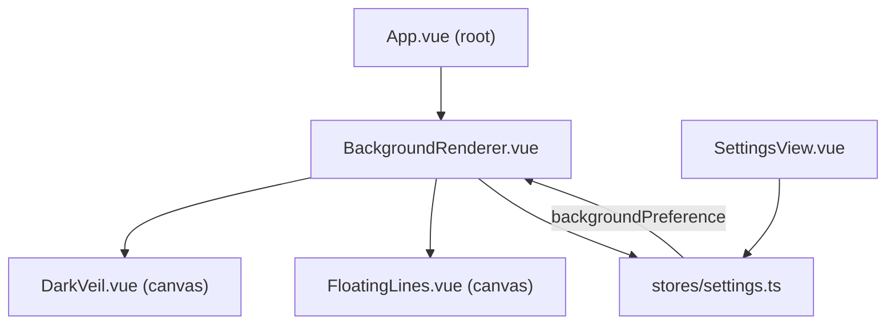
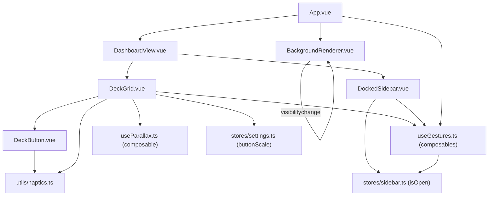

# Design Document: App Cleanup and Improvements

## Overview

This document describes the technical design for upgrading the VDock application across four
areas: Python backend cleanup, frontend debug log removal, responsive UI improvements, and
new visual/interactive features. The application is currently working; all changes are
additive or refactoring-based and must preserve existing functionality.

**Tech stack:** Vue 3 + TypeScript + Pinia (frontend), Python/Flask (backend), Electron wrapper,
CSS custom properties (no Tailwind, no component library).

**Guiding principle:** Every change is surgical. We touch only what the requirements specify,
and we verify nothing regresses.

---

## Architecture

### What Changes

| Layer | Area | Change Type |
|---|---|---|
| Backend | `utils/file_manager.py` | Replace `print()` with `logger.error()` |
| Backend | `routes/actions.py` | Use singleton `action_executor` from `app.py` |
| Backend | `routes/profiles.py` | Add `@require_auth`, remove inner logger redef |
| Backend | `routes/system_metrics.py` | Extract shared `metric_route()` decorator |
| Backend | `app.py` | Remove unused `os`, `logging` imports |
| Backend | `backend/nul` | Delete artifact file |
| Frontend | `stores/settings.ts` | Add `backgroundPreference` ref + persistence |
| Frontend | `App.vue` | Mount `BackgroundRenderer` at root |
| Frontend | `components/DeckButton.vue` | Glass styles, ripple, press/hover animations, min 60×60 |
| Frontend | `components/DockedSidebar.vue` | Glass panel, right-edge accent, overlay on narrow |
| Frontend | `views/SettingsView.vue` | Two-panel nav rail, fix `availableScenes`, copyright year |
| Frontend | `views/DashboardView.vue` | Responsive header, implement `selectAction` |
| Frontend | `views/ProfilesView.vue` | Responsive card grid |
| Frontend | `views/LoginView.vue` | Centered card, max-width 400px |
| Frontend | `assets/styles/main.css` | Glass tokens, breakpoint tokens, clamp() fonts |
| Frontend | `components/backgrounds/` | Add `DarkVeil.vue`, `FloatingLines.vue` |
| Frontend | `components/BackgroundRenderer.vue` | New root-level background switcher |

### What Stays the Same

- All existing routes, API contracts, and WebSocket events
- Profile data model and file storage format
- Authentication flow and token handling
- All existing button effects, animations, and action types
- Electron wrapper and build pipeline
- Existing background components (`BeamsBackground.vue`, `FloatingPathsBackground.vue`, etc.)

### Dependency Graph (new components)



---

## Components and Interfaces

### 1. BackgroundRenderer.vue

Mounted directly in `App.vue` before `<router-view />`. Reads `backgroundPreference` from
the settings store and conditionally renders the appropriate canvas component.

```
Props: none
Emits: none
Reads: settingsStore.backgroundPreference
```

Template structure:
```html
<Teleport to="body">
  <div class="background-layer">
    <DarkVeil v-if="pref === 'dark-veil'" />
    <FloatingLines v-else-if="pref === 'floating-lines'" />
    <!-- solid-color and none render nothing -->
  </div>
</Teleport>
```

CSS for `.background-layer`:
```css
.background-layer {
  position: fixed;
  inset: 0;
  z-index: 0;
  pointer-events: none;
}
```

### 2. DarkVeil.vue

Full-screen `<canvas>` component. Uses `requestAnimationFrame` loop to render:
- Dark semi-transparent base fill
- Noise texture (seeded random per-pixel grain)
- Horizontal scanline pass (every 4px, 3% opacity)
- Subtle warp displacement using a sine wave offset

```
Props: none
Lifecycle: onMounted → start RAF loop; onUnmounted → cancel RAF
```

### 3. FloatingLines.vue

Full-screen `<canvas>` component. Animates gradient-colored floating line segments using
colors `#E945F5`, `#2F4BC0`, `#E945F5`. Features:
- N lines (default 12) with independent velocity, angle, and thickness
- Mouse parallax: lines shift slightly toward cursor position
- Bend effect: each line curves using a quadratic bezier with a time-varying control point

```
Props: none
Lifecycle: onMounted → attach mousemove listener + start RAF; onUnmounted → cleanup
```

### 4. DeckButton.vue (modifications)

**Glass styling** — applied via the existing `deck-button-glass` class path, extended with
the new `--glass-*` tokens.

**Ripple effect** — JavaScript-driven (CSS-only ripple cannot originate from touch point):
```typescript
function triggerRipple(event: PointerEvent) {
  // create span, position at event.offsetX/Y, animate scale 0→1 + opacity 1→0, remove
}
```

**Press animation** — `:active` state: `transform: scale(0.94)`, box-shadow collapse,
`transition: 80ms ease`.

**Hover lift** — `:hover:not(:active)` on pointer devices: `transform: translateY(-2px)`,
increased glow. Guarded by `@media (hover: hover)` to avoid sticky hover on touch.

**Minimum touch target** — `min-width: 60px; min-height: 60px` on `.deck-button`.

**Placeholder cell** — when `button` prop is absent (empty grid slot in non-edit mode),
render a dashed-border placeholder with a `+` icon at low opacity.

### 5. DockedSidebar.vue (modifications)

**Glass panel** — replace `background-color: var(--color-surface-solid)` with:
```css
background: var(--glass-bg);
backdrop-filter: blur(var(--glass-blur));
```

**Right-edge accent** — add `border-right: 2px solid rgba(var(--color-primary-rgb), 0.6)`.

**Section label** — `.sidebar-header h3` gets `text-transform: uppercase; letter-spacing: 0.1em; font-size: 0.65rem`.

**Overlay mode on narrow screens** — at `max-width: 480px`, the sidebar uses
`position: fixed; left: -100%; transition: left 200ms ease` and a floating toggle button
(hamburger icon, `position: fixed; bottom: 1rem; left: 1rem; z-index: 200`) controls
`left: 0` vs `left: -100%`.

### 6. SettingsView.vue (redesign)

**Two-panel layout:**
```
┌──────────────┬──────────────────────────────────┐
│  Nav Rail    │  Content Panel                   │
│  220px fixed │  flex: 1, overflow-y: auto       │
│              │                                  │
│  [icon] Tab  │  ┌─ Card ──────────────────────┐ │
│  [icon] Tab  │  │  Section Title              │ │
│  [icon] Tab  │  │  ─────────────────────────  │ │
│  [icon] Tab  │  │  form controls...           │ │
│              │  └─────────────────────────────┘ │
└──────────────┴──────────────────────────────────┘
```

**Nav rail breakpoints:**
- `>= 900px`: 220px wide, icon + label
- `640px – 899px`: 48px wide, icon only + tooltip on hover
- `< 640px`: horizontal scrollable icon bar at top, content below

**Active state indicator:** left accent bar (`border-left: 3px solid var(--color-primary)`)
+ background highlight (`background: var(--glass-bg)`).

**Fix `availableScenes`:** Change from `profile.pages.flatMap(p => p.scenes)` to
`profile.scenes` directly, matching the `Profile` type definition.

**Copyright year:** Change `2025 ©` to `2026 ©`.

### 7. DashboardView.vue — selectAction implementation

Replace the TODO stub with:
```typescript
function selectAction(actionType: ActionType) {
  if (!selectedPlaceholderCell.value) {
    notificationsStore.warn('Select a grid cell first', 'Click an empty cell before choosing an action.')
    return
  }
  openButtonEditor({ action: { type: actionType, config: {} } })
}
```

### 8. Python Backend — metric_route decorator

New decorator in `routes/system_metrics.py` (or a shared `routes/_helpers.py`):
```python
def metric_route(fetch_fn):
    """Wraps a metrics fetch function in standard try/except/jsonify."""
    @wraps(fetch_fn)
    def wrapper(*args, **kwargs):
        try:
            data = fetch_fn(*args, **kwargs)
            return jsonify({'success': True, 'data': data})
        except Exception as e:
            logger.error('Metrics error: %s', e)
            return jsonify({'success': False, 'error': str(e)}), 500
    return wrapper
```

Each route handler becomes:
```python
@system_metrics_bp.route('/cpu', methods=['GET'])
def get_cpu_metrics():
    return metric_route(SystemMetrics.get_cpu_metrics)()
```

### 9. Python Backend — ActionExecutor singleton

`routes/actions.py` is refactored to import the singleton:
```python
from app import action_executor  # noqa: E402 (post-init import)
```

If `action_executor` is `None` at request time, return 503:
```python
if action_executor is None:
    return jsonify({'error': 'Action executor unavailable', 'success': False}), 503
```

---

## Data Models

### Settings Store — backgroundPreference

Added to `stores/settings.ts`:
```typescript
type BackgroundPreference = 'none' | 'solid-color' | 'dark-veil' | 'floating-lines'
const backgroundPreference = ref<BackgroundPreference>('none')
```

Persisted in `localStorage` under key `vdock_settings` alongside existing settings.
Loaded in `loadSettings()`, saved in `saveSettings()`.

### Backend config.json — no change

Background preference is a frontend-only setting stored in `localStorage`. The requirements
say "persist to the application configuration file" — in the context of this Electron app,
`localStorage` is the application configuration store (it persists across sessions in the
Electron renderer process). No backend API change is needed.

---

## Responsive Layout Strategy

### Breakpoint Tokens (added to `:root` in `main.css`)

```css
:root {
  --bp-sm: 480px;
  --bp-md: 768px;
  --bp-lg: 1024px;
  --bp-xl: 1366px;
  --bp-2xl: 1920px;
}
```

These are documentation tokens — CSS media queries use the literal values since custom
properties cannot be used inside `@media` expressions.

### CSS Grid Template Areas — main layout

Applied to the dashboard layout wrapper:
```css
.dashboard-layout {
  display: grid;
  grid-template-areas:
    "header header"
    "sidebar grid";
  grid-template-columns: var(--sidebar-width, 150px) 1fr;
  grid-template-rows: auto 1fr;
  height: 100vh;
}

@media (max-width: 480px) {
  .dashboard-layout {
    grid-template-areas:
      "header"
      "grid";
    grid-template-columns: 1fr;
  }
}
```

### DeckGrid — auto-sizing square cells

```css
.deck-grid {
  display: grid;
  grid-template-columns: repeat(var(--grid-cols, 5), 1fr);
  gap: var(--spacing-sm);
}

.deck-grid > * {
  aspect-ratio: 1 / 1;
}
```

### Fluid Typography — clamp()

All font-size declarations in `main.css` and component `<style>` blocks are updated to use
`clamp(min, preferred, max)`:
```css
/* Example */
body { font-size: clamp(13px, 1vw + 10px, 18px); }
.button-label { font-size: clamp(11px, 0.8vw + 8px, 16px); }
```

### No Horizontal Scroll

`#app` already has `overflow: hidden`. The grid uses `1fr` columns so it never exceeds
viewport width. The sidebar uses `flex-shrink: 0` but is hidden at `< 480px`.

---

## Glass Design Token System

Added to `.theme-dark` in `main.css`:
```css
.theme-dark {
  /* existing tokens ... */

  /* Glassmorphism tokens */
  --glass-bg: rgba(0, 0, 0, 0.25);
  --glass-border: rgba(255, 255, 255, 0.12);
  --glass-blur: 14px;
  --glass-shadow: 0 8px 32px rgba(0, 0, 0, 0.4), inset 0 1px 0 rgba(255, 255, 255, 0.08);
  --glass-glow: 0 0 20px rgba(52, 152, 219, 0.25);
}
```

**DeckButton glass application:**
```css
.deck-button {
  background: var(--glass-bg);
  backdrop-filter: blur(var(--glass-blur));
  border: 1px solid var(--glass-border);
  box-shadow: var(--glass-shadow);
}
```

**Header frosted glass:**
```css
.dashboard-header {
  background: rgba(0, 0, 0, 0.3);
  backdrop-filter: blur(12px);
  border-bottom: 1px solid var(--glass-border);
}
```

---

## Animation and Interaction Design

### DeckButton Press (`:active`)
```css
.deck-button:active:not(.edit-mode) {
  transform: scale(0.94);
  box-shadow: inset 0 2px 8px rgba(0, 0, 0, 0.3);
  transition: transform 80ms ease, box-shadow 80ms ease;
}
```

### DeckButton Hover Lift
```css
@media (hover: hover) {
  .deck-button.has-action:hover:not(.edit-mode) {
    transform: translateY(-2px);
    box-shadow: var(--glass-shadow), var(--glass-glow);
    transition: transform 150ms ease, box-shadow 150ms ease;
  }
}
```

### Ripple Effect (JavaScript)
```typescript
function triggerRipple(event: PointerEvent) {
  const el = event.currentTarget as HTMLElement
  const ripple = document.createElement('span')
  const rect = el.getBoundingClientRect()
  const size = Math.max(rect.width, rect.height)
  ripple.className = 'ripple'
  ripple.style.cssText = `
    width: ${size}px; height: ${size}px;
    left: ${event.clientX - rect.left - size / 2}px;
    top: ${event.clientY - rect.top - size / 2}px;
  `
  el.appendChild(ripple)
  ripple.addEventListener('animationend', () => ripple.remove())
}
```

```css
.ripple {
  position: absolute;
  border-radius: 50%;
  background: rgba(255, 255, 255, 0.35);
  transform: scale(0);
  animation: ripple-expand 400ms ease-out forwards;
  pointer-events: none;
}

@keyframes ripple-expand {
  to { transform: scale(2.5); opacity: 0; }
}
```

---

## Data Flow — Background Preference Persistence

```
User selects background in SettingsView
  → settingsStore.backgroundPreference = 'dark-veil'
  → watch() triggers saveSettings()
  → localStorage.setItem('vdock_settings', JSON.stringify({..., backgroundPreference: 'dark-veil'}))

App launch:
  → settingsStore.loadSettings()
  → reads backgroundPreference from localStorage (default: 'none' if missing/invalid)
  → BackgroundRenderer.vue reads computed backgroundPreference
  → renders DarkVeil / FloatingLines / nothing
```

---

## Error Handling

### Backend

- `FileManager` methods: catch `Exception`, log via `logger.error('%s', e)`, return
  `False` / `None` / `[]` as appropriate (no change to return types).
- `routes/actions.py`: if `action_executor is None`, return HTTP 503 with JSON error body.
- `routes/profiles.py`: remove inner `setup_logger` call; the module-level `logger` is
  already defined and handles all error logging.
- `routes/system_metrics.py`: the `metric_route` decorator catches all exceptions and
  returns a consistent `{'success': False, 'error': str(e)}` with HTTP 500.

### Frontend

- `BackgroundRenderer`: wraps canvas initialization in `try/catch`; on error, sets
  `backgroundPreference` to `'none'` and logs via `console.error`.
- `DarkVeil` / `FloatingLines`: if `getContext('2d')` returns null (e.g., canvas not
  supported), the component renders nothing and logs a warning.
- `selectAction`: if no placeholder cell is selected, shows a notification (no throw).
- `availableScenes`: returns `[]` when `profile` is null or `profile.scenes` is empty,
  never throws.

---

## Correctness Properties

*A property is a characteristic or behavior that should hold true across all valid executions
of a system — essentially, a formal statement about what the system should do. Properties
serve as the bridge between human-readable specifications and machine-verifiable correctness
guarantees.*

### Property 1: availableScenes never throws

*For any* profile object (including profiles with zero scenes, one scene, or many scenes),
calling the `availableScenes` computed property SHALL return an array (possibly empty)
without throwing a runtime error.

**Validates: Requirements 10.1, 10.2**

---

### Property 2: Profile routes require auth when REQUIRE_AUTH is enabled

*For any* profile route (`GET /api/profiles`, `GET /api/profiles/<id>`,
`POST /api/profiles`, `PUT /api/profiles/<id>`), when `Config.REQUIRE_AUTH` is `True`
and the request carries no valid auth token, the response status SHALL be 401 or 403.

**Validates: Requirements 12.1, 12.2, 12.3, 12.4**

---

### Property 3: FileManager logs errors via logger, not stdout

*For any* FileManager method (`save_json`, `load_json`, `delete_file`, `copy_file`,
`list_files`), when the underlying I/O operation raises an exception, the module-level
`logger.error` SHALL be called and no `print()` call SHALL be made.

**Validates: Requirements 2.2, 13.1, 13.2, 13.3, 13.4, 13.5, 13.6**

---

### Property 4: DeckButton minimum touch target

*For any* DeckButton rendered in the grid (regardless of configured button size or grid
dimensions), the rendered element's bounding box SHALL be at least 60×60 CSS pixels.

**Validates: Requirements 17.3**

---

### Property 5: Background preference round-trip

*For any* valid `BackgroundPreference` value (`'none'`, `'solid-color'`, `'dark-veil'`,
`'floating-lines'`), setting `backgroundPreference` in the settings store, calling
`saveSettings()`, then calling `loadSettings()` SHALL result in the same preference value
being restored.

**Validates: Requirements 15.7, 15.8**

---

### Property 6: SettingsView form controls meet touch target height

*For any* form control rendered in `SettingsView` (sliders, checkboxes, selects), the
rendered element's height SHALL be at least 44px.

**Validates: Requirements 19.6**

---

### Property 7: No horizontal overflow at any supported viewport width

*For any* viewport width in the range [320px, 3840px], the document body SHALL NOT have
`scrollWidth > clientWidth` (i.e., no horizontal scrollbar or clipped overflow).

**Validates: Requirements 20.5**

---

### Property 8: Font sizes use clamp() for fluid scaling

*For any* font-size declaration in `main.css` and component `<style>` blocks that sets a
base text size, the value SHALL use `clamp()` with a defined minimum and maximum, ensuring
the font never falls below the minimum or exceeds the maximum across the supported viewport
range.

**Validates: Requirements 20.4**

---

## Testing Strategy

### Dual Testing Approach

Both unit tests and property-based tests are required. Unit tests catch concrete bugs at
specific inputs; property tests verify universal correctness across all inputs.

### Unit Tests

Focus areas:
- `availableScenes` computed: test with null profile, empty scenes array, populated scenes
- `selectAction`: test with no cell selected (expect notification), with cell selected
  (expect editor open)
- `BackgroundRenderer`: test that correct child component is rendered for each preference
  value; test fallback to `'none'` on invalid preference
- Copyright year: render `SettingsView` About tab, assert text contains "2026"
- `routes/actions.py`: mock `action_executor = None`, assert 503 response
- `FileManager`: mock file I/O to raise `OSError`, assert `logger.error` called, assert
  no `print()` called

### Property-Based Tests

Use **Hypothesis** (Python) for backend properties and **fast-check** (TypeScript) for
frontend properties. Each test runs a minimum of 100 iterations.

**Property 1 — availableScenes never throws**
```
# Feature: app-cleanup-and-improvements, Property 1: availableScenes never throws
@given(profile=st.one_of(st.none(), profile_strategy()))
def test_available_scenes_never_throws(profile):
    result = compute_available_scenes(profile)
    assert isinstance(result, list)
```

**Property 2 — Profile routes require auth**
```
# Feature: app-cleanup-and-improvements, Property 2: profile routes require auth
@given(route=st.sampled_from(PROFILE_ROUTES), method=st.sampled_from(['GET','POST','PUT']))
def test_profile_routes_require_auth(route, method):
    with app.test_client() as c:
        resp = getattr(c, method.lower())(route)
        assert resp.status_code in (401, 403)
```

**Property 3 — FileManager logs via logger**
```
# Feature: app-cleanup-and-improvements, Property 3: FileManager logs errors via logger
@given(method=st.sampled_from(['save_json','load_json','delete_file','copy_file','list_files']))
def test_file_manager_uses_logger(method, tmp_path, mocker):
    mock_logger = mocker.patch('utils.file_manager.logger')
    trigger_io_error(method, tmp_path)
    assert mock_logger.error.called
```

**Property 4 — DeckButton minimum touch target**
```typescript
// Feature: app-cleanup-and-improvements, Property 4: DeckButton minimum touch target
fc.assert(fc.property(
  fc.record({ rows: fc.integer({min:1,max:5}), cols: fc.integer({min:1,max:5}) }),
  ({ rows, cols }) => {
    const wrapper = mount(DeckButton, { props: { button: makeButton(rows, cols) } })
    const rect = wrapper.element.getBoundingClientRect()
    return rect.width >= 60 && rect.height >= 60
  }
), { numRuns: 100 })
```

**Property 5 — Background preference round-trip**
```typescript
// Feature: app-cleanup-and-improvements, Property 5: background preference round-trip
fc.assert(fc.property(
  fc.constantFrom('none', 'solid-color', 'dark-veil', 'floating-lines'),
  (pref) => {
    const store = useSettingsStore()
    store.backgroundPreference = pref
    store.saveSettings()
    store.loadSettings()
    return store.backgroundPreference === pref
  }
), { numRuns: 100 })
```

**Property 6 — SettingsView form controls touch target**
```typescript
// Feature: app-cleanup-and-improvements, Property 6: SettingsView form controls touch target
fc.assert(fc.property(
  fc.constantFrom('appearance', 'server', 'integration', 'about'),
  (tab) => {
    const wrapper = mount(SettingsView)
    wrapper.vm.activeTab = tab
    const controls = wrapper.findAll('input, select')
    return controls.every(c => c.element.getBoundingClientRect().height >= 44)
  }
), { numRuns: 100 })
```

**Property 7 — No horizontal overflow**
```typescript
// Feature: app-cleanup-and-improvements, Property 7: no horizontal overflow
fc.assert(fc.property(
  fc.integer({ min: 320, max: 3840 }),
  (width) => {
    document.documentElement.style.width = `${width}px`
    return document.body.scrollWidth <= document.body.clientWidth
  }
), { numRuns: 200 })
```

**Property 8 — Font sizes use clamp()**
```typescript
// Feature: app-cleanup-and-improvements, Property 8: font sizes use clamp()
// Static analysis: parse main.css and all component <style> blocks,
// assert every font-size value that is not 'inherit' or 'em' uses clamp()
fc.assert(fc.property(
  fc.constantFrom(...FONT_SIZE_DECLARATIONS),
  (decl) => /^clamp\(/.test(decl.value)
), { numRuns: 100 })
```


---

## Touch Interaction System

This section covers the design for Requirements 21–26: the gesture composable layer,
swipe navigation, pinch-to-zoom, long-press drag-to-reorder, edit mode visuals, haptic
feedback, glow animations, edge-swipe sidebar, background pause, and device-orientation
parallax.

---

### Architecture Overview



---

### 1. Touch Gesture Composable — `useGestures.ts`

**File:** `frontend/src/composables/useGestures.ts`

A single composable module exporting four gesture hooks. All listeners are registered
with `{ passive: true }` unless `preventDefault()` is required (drag reorder only).

#### 1.1 `useTouchSwipe`

```typescript
useTouchSwipe(
  el: Ref<HTMLElement | null>,
  options: {
    onSwipeLeft?: (velocity: number) => void
    onSwipeRight?: (velocity: number) => void
    onSwipeUp?: (velocity: number) => void
    onSwipeDown?: (velocity: number) => void
    threshold?: number  // default: 10px
  }
)
```

Implementation sketch:
```typescript
// touchstart: record startX, startY, startTime
// touchmove: compute deltaX, deltaY
// touchend: compute velocity = distance / (endTime - startTime)
//   if abs(deltaX) > threshold and abs(deltaX) > abs(deltaY): fire left/right
//   if abs(deltaY) > threshold and abs(deltaY) > abs(deltaX): fire up/down
// All listeners: { passive: true }
```

Velocity is passed to callbacks in px/ms so callers can apply momentum logic.

#### 1.2 `usePinchZoom`

```typescript
usePinchZoom(
  el: Ref<HTMLElement | null>,
  options: { onPinch: (scale: number) => void }
)
```

Implementation sketch:
```typescript
// touchstart: if touches.length === 2, record initialDistance
// touchmove: if touches.length === 2, compute currentDistance
//   scale = currentDistance / initialDistance
//   fire onPinch(scale)
// Listener: { passive: true }
```

#### 1.3 `useLongPress`

```typescript
useLongPress(
  el: Ref<HTMLElement | null>,
  options: {
    onLongPress: () => void
    duration?: number  // default: 500ms
  }
)
```

Implementation sketch:
```typescript
// touchstart: record startX, startY; set timer for `duration` ms
// touchmove: if distance from start > 5px, clearTimeout(timer)
// touchend: clearTimeout(timer)
// Listener: { passive: true }
```

#### 1.4 `useEdgeSwipe`

```typescript
useEdgeSwipe(
  options: {
    threshold?: number  // default: 20px from left edge
    onEdgeSwipeRight?: () => void
  }
)
```

Implementation sketch:
```typescript
// Attaches to document
// touchstart: if touch.clientX <= threshold, record as edge touch
// touchend: if was edge touch and deltaX > 30px rightward, fire onEdgeSwipeRight
// Listener: { passive: true }
```

---

### 2. DeckGrid Swipe Navigation

**File:** `frontend/src/components/DeckGrid.vue`

#### 2.1 Swipe Wiring

```typescript
useTouchSwipe(gridRef, {
  onSwipeLeft:  (v) => handlePageSwipe('next', v),
  onSwipeRight: (v) => handlePageSwipe('prev', v),
  onSwipeUp:    (v) => handleSceneSwipe('next', v),
  onSwipeDown:  (v) => handleSceneSwipe('prev', v),
  threshold: 10,
})
```

#### 2.2 Real-Time Follow + Snap

During an active swipe, `translateX` follows the finger with no CSS transition applied.
On `touchend`, the transition class is re-applied and the grid snaps to the target page.

```typescript
// touchmove handler (non-passive, called from useTouchSwipe internals):
gridStyle.value = { transform: `translateX(${currentDelta}px)` }

// touchend / snap:
function snap(targetPage: number) {
  gridStyle.value = {
    transform: `translateX(${-targetPage * 100}%)`,
    transition: 'transform 200ms ease-out',
    willChange: 'transform',
  }
}
```

#### 2.3 Momentum

```typescript
function handlePageSwipe(direction: 'next' | 'prev', velocity: number) {
  const threshold = 0.3  // px/ms
  const halfwayThreshold = 0.5  // 50% of page width
  const shouldAdvance = velocity > threshold || Math.abs(currentDelta) > pageWidth * halfwayThreshold
  if (shouldAdvance) navigatePage(direction)
  else snap(currentPage.value)
}
```

#### 2.4 PageIndicator Component

```
Props:
  currentPage: number
  totalPages: number
  swipeProgress: number  // 0–1 float, interpolated during drag
```

The active dot's position is computed as:
```typescript
const activeDotOffset = computed(() =>
  (currentPage.value + swipeProgress.value) * DOT_SPACING_PX
)
```

CSS: dots use `transform: translateX()` driven by `activeDotOffset` for smooth tracking.

---

### 3. Pinch-to-Zoom Grid

**File:** `frontend/src/components/DeckGrid.vue`

```typescript
usePinchZoom(gridRef, {
  onPinch(scale: number) {
    const current = settingsStore.buttonSize  // existing setting, maps to --button-scale
    const next = Math.min(2.0, Math.max(0.6, current * scale))
    dashboardStore.buttonScale = next
    settingsStore.buttonSize = next
    settingsStore.saveSettings()
  }
})
```

CSS for grid cells:
```css
.deck-grid-cell {
  aspect-ratio: 1 / 1;
  width: calc(var(--button-base-size) * var(--button-scale));
}
```

`--button-scale` is set on `.deck-grid` via a CSS custom property bound to
`dashboardStore.buttonScale`.

---

### 4. Long-Press + Drag-to-Reorder

#### 4.1 Long-Press Trigger

`DeckButton.vue` wires `useLongPress` and emits `long-press` with the button's cell index:

```typescript
useLongPress(buttonRef, {
  onLongPress() {
    haptics.longPress()
    emit('long-press', props.cellIndex)
  },
  duration: 500,
})
```

`DeckGrid.vue` listens for `@long-press` and enters edit mode + starts drag.

#### 4.2 Ghost Element

On `long-press`, `DeckGrid` creates a ghost:

```typescript
function startDrag(cellIndex: number, touch: Touch) {
  editMode.value = true
  const source = getCellElement(cellIndex)
  ghost = source.cloneNode(true) as HTMLElement
  Object.assign(ghost.style, {
    position: 'fixed',
    opacity: '0.7',
    pointerEvents: 'none',
    willChange: 'transform',
    width: `${source.offsetWidth}px`,
    height: `${source.offsetHeight}px`,
    zIndex: '1000',
  })
  document.body.appendChild(ghost)
  moveGhost(touch.clientX, touch.clientY)
}

function moveGhost(x: number, y: number) {
  ghost.style.transform = `translate(${x - ghostOffsetX}px, ${y - ghostOffsetY}px)`
}
```

#### 4.3 Hit-Testing and Drop Target

On each `touchmove` during drag:

```typescript
function onDragMove(e: TouchEvent) {
  const { clientX, clientY } = e.touches[0]
  moveGhost(clientX, clientY)
  const el = document.elementFromPoint(clientX, clientY)
  const cell = el?.closest('[data-cell-index]')
  if (cell && cell !== currentDropTarget) {
    currentDropTarget?.classList.remove('drop-target')
    currentDropTarget = cell as HTMLElement
    currentDropTarget.classList.add('drop-target')
  }
}
```

#### 4.4 Drop and Spring Animation

On `touchend`:

```typescript
function onDragEnd() {
  ghost.remove()
  if (currentDropTarget) {
    const targetIndex = Number(currentDropTarget.dataset.cellIndex)
    dashboardStore.swapButtons(dragSourceIndex, targetIndex)
    haptics.success()
    // Apply spring animation to the destination cell
    const destEl = getCellElement(targetIndex)
    destEl.classList.add('spring-in')
    destEl.addEventListener('animationend', () => destEl.classList.remove('spring-in'), { once: true })
  }
  currentDropTarget?.classList.remove('drop-target')
  editMode.value = false
}
```

Spring keyframe:
```css
@keyframes spring-in {
  0%   { transform: scale(1.0) }
  40%  { transform: scale(1.1) }
  70%  { transform: scale(0.95) }
  100% { transform: scale(1.0) }
}
.spring-in { animation: spring-in 300ms ease-out forwards; }
```

---

### 5. Edit Mode Visual Design

Applied via `.edit-mode` class on `.deck-grid`:

```css
/* Non-selected buttons dim and become non-interactive */
.deck-grid.edit-mode .deck-button:not(.selected) {
  filter: brightness(0.6);
  pointer-events: none;
}

/* All buttons wiggle */
.deck-grid.edit-mode .deck-button {
  animation: wiggle 0.4s ease-in-out infinite alternate;
}

@keyframes wiggle {
  from { transform: rotate(-2deg); }
  to   { transform: rotate(2deg); }
}

/* Drag handle via pseudo-element */
.deck-grid.edit-mode .deck-button::after {
  content: '⠿';
  position: absolute;
  top: 4px;
  right: 4px;
  font-size: 12px;
  opacity: 0.7;
  pointer-events: none;
}

/* Drop target highlight */
.deck-button.drop-target {
  outline: 2px solid var(--color-primary);
  outline-offset: 2px;
}
```

**Exit triggers** (all set `editMode.value = false`):
- Tap outside any button (`@click.self` on `.deck-grid` wrapper)
- `Escape` keydown listener (registered in `onMounted`, removed in `onUnmounted`)
- "Done" button click in the dashboard header (shown only when `editMode` is true)
- Completing a drag drop (`onDragEnd`)

---

### 6. Haptic Feedback

**File:** `frontend/src/utils/haptics.ts`

```typescript
export const haptics = {
  tap:       () => navigator.vibrate?.(10),
  longPress: () => navigator.vibrate?.(30),
  success:   () => navigator.vibrate?.([10, 50, 10]),
  error:     () => navigator.vibrate?.(100),
}
```

The optional chaining (`?.`) ensures no error is thrown on browsers without the
Vibration API. Call sites:

| Event | Call |
|---|---|
| DeckButton press | `haptics.tap()` |
| Long-press trigger | `haptics.longPress()` |
| Successful drag drop | `haptics.success()` |
| Action execution error | `haptics.error()` |

---

### 7. Glow Pulse Animation

After a button action executes successfully, `DeckButton.vue` adds `.triggered` for 500ms:

```typescript
async function executeAction() {
  try {
    await props.button.action.execute()
    buttonEl.value?.classList.add('triggered')
    setTimeout(() => buttonEl.value?.classList.remove('triggered'), 500)
  } catch {
    haptics.error()
  }
}
```

```css
@keyframes glow-pulse {
  0%   { box-shadow: var(--glass-shadow), 0 0 30px rgba(255, 255, 255, 0.6); }
  100% { box-shadow: var(--glass-shadow); }
}

.deck-button.triggered {
  animation: glow-pulse 500ms ease-out forwards;
}
```

---

### 8. Edge Swipe for Sidebar

**File:** `frontend/src/App.vue` (or `DashboardView.vue`)

```typescript
useEdgeSwipe({
  threshold: 20,
  onEdgeSwipeRight() {
    sidebarStore.isOpen = true
  },
})
```

Sidebar open/close CSS:
```css
.docked-sidebar {
  transform: translateX(-100%);
  transition: transform 200ms ease;
}
.docked-sidebar.open {
  transform: translateX(0);
}
```

Swipe-to-close on the sidebar itself:
```typescript
// In DockedSidebar.vue
useTouchSwipe(sidebarRef, {
  onSwipeLeft() { sidebarStore.isOpen = false },
  threshold: 10,
})
```

---

### 9. Page Visibility — Background Pause

**File:** `frontend/src/components/BackgroundRenderer.vue` (and canvas child components)

```typescript
// In DarkVeil.vue / FloatingLines.vue
let rafId: number

function startLoop() {
  rafId = requestAnimationFrame(tick)
}

function stopLoop() {
  cancelAnimationFrame(rafId)
}

onMounted(() => {
  startLoop()
  document.addEventListener('visibilitychange', () => {
    if (document.hidden) stopLoop()
    else startLoop()
  })
})

onUnmounted(() => {
  stopLoop()
})
```

---

### 10. DeviceOrientation Parallax

**File:** `frontend/src/composables/useParallax.ts`

```typescript
export function useParallax(el: Ref<HTMLElement | null>) {
  if (typeof window === 'undefined' || !window.DeviceOrientationEvent) return

  let smoothBeta = 0
  let smoothGamma = 0
  const alpha = 0.1  // EMA smoothing factor

  function onOrientation(e: DeviceOrientationEvent) {
    const beta  = e.beta  ?? 0  // -180 to 180 (front/back tilt)
    const gamma = e.gamma ?? 0  // -90 to 90 (left/right tilt)

    // Exponential moving average to reduce jitter
    smoothBeta  = alpha * beta  + (1 - alpha) * smoothBeta
    smoothGamma = alpha * gamma + (1 - alpha) * smoothGamma

    // Clamp to ±3 degrees of visual rotation
    const rotX = Math.max(-3, Math.min(3, smoothBeta  * 0.05))
    const rotY = Math.max(-3, Math.min(3, smoothGamma * 0.05))

    if (el.value) {
      el.value.style.transform = `perspective(800px) rotateX(${rotX}deg) rotateY(${rotY}deg)`
    }
  }

  onMounted(() => window.addEventListener('deviceorientation', onOrientation))
  onUnmounted(() => window.removeEventListener('deviceorientation', onOrientation))
}
```

Used in `DeckGrid.vue`:
```typescript
const gridRef = ref<HTMLElement | null>(null)
useParallax(gridRef)
```

Graceful degradation: the early return when `DeviceOrientationEvent` is undefined means
the grid renders normally with no transform applied and no error thrown.

---

## Correctness Properties (Touch Interaction System)

*A property is a characteristic or behavior that should hold true across all valid executions
of a system — essentially, a formal statement about what the system should do. Properties
serve as the bridge between human-readable specifications and machine-verifiable correctness
guarantees.*

### Property 9: Swipe threshold — no navigation below 10px

*For any* touch gesture on the DeckGrid where the total displacement from the touch origin
is less than 10px in any direction, the current page index and scene index SHALL remain
unchanged after the gesture completes.

**Validates: Requirements 21.8**

---

### Property 10: Pinch scale bounds

*For any* pinch gesture producing an intermediate scale factor (however large or small),
the resulting `dashboardStore.buttonScale` SHALL always be clamped to the range [0.6, 2.0]
inclusive.

**Validates: Requirements 21.6**

---

### Property 11: Long-press cancels on movement > 5px

*For any* touch sequence where the finger moves more than 5px from the initial touch point
before 500ms has elapsed, the long-press callback SHALL NOT fire.

**Validates: Requirements 22.1, 22.2**

---

### Property 12: Haptics never throws

*For any* call to `haptics.tap()`, `haptics.longPress()`, `haptics.success()`, or
`haptics.error()` in a browser environment where `navigator.vibrate` is undefined,
the call SHALL complete without throwing a runtime error.

**Validates: Requirements 22.7**

---

### Property 13: Swipe navigation direction correctness

*For any* DeckGrid state with N pages, a left swipe SHALL result in `currentPage`
incrementing by 1 (clamped to N-1), and a right swipe SHALL result in `currentPage`
decrementing by 1 (clamped to 0). The direction of navigation SHALL never be reversed.

**Validates: Requirements 21.1, 21.2**

---

### Property 14: Scene navigation direction correctness

*For any* DeckGrid state with M scenes, an up swipe SHALL result in `currentScene`
incrementing by 1 (clamped to M-1), and a down swipe SHALL result in `currentScene`
decrementing by 1 (clamped to 0).

**Validates: Requirements 21.3, 21.4**

---

### Property 15: Momentum advance on fast flick

*For any* swipe gesture where the measured velocity exceeds 0.3 px/ms, the DeckGrid
SHALL advance to the next page in the swipe direction regardless of how far the finger
traveled (even if displacement is less than 50% of page width).

**Validates: Requirements 21.9**

---

### Property 16: Sidebar open/close round-trip

*For any* initial sidebar state (open or closed), performing an edge swipe right SHALL
result in the sidebar being open, and subsequently performing a left swipe on the sidebar
SHALL result in the sidebar being closed — restoring the closed state.

**Validates: Requirements 23.1, 23.2**

---

### Property 17: Drag-drop data swap correctness

*For any* two distinct valid cell indices A and B in the DeckGrid, completing a
drag-to-reorder from cell A to cell B SHALL result in the button data at index A moving
to index B and the button data at index B moving to index A, with no other cells affected.

**Validates: Requirements 22.3, 22.4, 22.5**

---

### Property 18: Parallax graceful degradation

*For any* environment where `window.DeviceOrientationEvent` is `undefined`, calling
`useParallax()` SHALL complete without throwing a runtime error, and the grid element
SHALL render without any `transform` style applied by the parallax system.

**Validates: Requirements 24.4**

---

### Property 19: swipeProgress bounds

*For any* swipe gesture in progress on the DeckGrid, the `swipeProgress` value passed to
`PageIndicator` SHALL always be a number in the range [0.0, 1.0] inclusive, never negative
and never greater than 1.

**Validates: Requirements 21.7, 24.5**

---

## Testing Strategy (Touch Interaction System)

### Unit Tests

- `useGestures.ts`: test each composable with simulated `TouchEvent` sequences
  - `useTouchSwipe`: verify threshold (< 10px → no callback), direction detection, velocity calculation
  - `usePinchZoom`: verify scale calculation from two-finger distance delta
  - `useLongPress`: verify 500ms timer fires callback; verify movement > 5px cancels timer
  - `useEdgeSwipe`: verify only touches starting within threshold px fire callback
- `haptics.ts`: call all four functions with `navigator.vibrate` stubbed as `undefined`; assert no throw
- `DeckGrid` drag-drop: mock `document.elementFromPoint`, verify `swapButtons` called with correct indices
- `BackgroundRenderer` visibility: simulate `visibilitychange` events, verify RAF start/stop calls
- `useParallax`: call with `window.DeviceOrientationEvent = undefined`, assert no error

### Property-Based Tests

Use **fast-check** (TypeScript). Each test runs a minimum of 100 iterations.

**Property 9 — Swipe threshold**
```typescript
// Feature: app-cleanup-and-improvements, Property 9: swipe threshold no navigation below 10px
fc.assert(fc.property(
  fc.record({ dx: fc.float({ min: -9.9, max: 9.9 }), dy: fc.float({ min: -9.9, max: 9.9 }) }),
  ({ dx, dy }) => {
    const { currentPage, currentScene, simulateSwipe } = mountDeckGrid()
    const before = { page: currentPage.value, scene: currentScene.value }
    simulateSwipe(dx, dy)
    return currentPage.value === before.page && currentScene.value === before.scene
  }
), { numRuns: 200 })
```

**Property 10 — Pinch scale bounds**
```typescript
// Feature: app-cleanup-and-improvements, Property 10: pinch scale bounds [0.6, 2.0]
fc.assert(fc.property(
  fc.float({ min: 0.01, max: 10.0 }),
  (rawScale) => {
    const store = useDashboardStore()
    store.buttonScale = 1.0
    simulatePinch(rawScale)
    return store.buttonScale >= 0.6 && store.buttonScale <= 2.0
  }
), { numRuns: 200 })
```

**Property 11 — Long-press cancels on movement > 5px**
```typescript
// Feature: app-cleanup-and-improvements, Property 11: long-press cancels on movement > 5px
fc.assert(fc.property(
  fc.record({ dx: fc.float({ min: 5.1, max: 200 }), dy: fc.float({ min: 5.1, max: 200 }) }),
  ({ dx, dy }) => {
    const fired = ref(false)
    const { simulateTouchWithMove } = mountLongPress({ onLongPress: () => { fired.value = true } })
    simulateTouchWithMove(dx, dy, 400)  // move before 500ms
    return fired.value === false
  }
), { numRuns: 100 })
```

**Property 12 — Haptics never throws**
```typescript
// Feature: app-cleanup-and-improvements, Property 12: haptics never throws without Vibration API
fc.assert(fc.property(
  fc.constantFrom('tap', 'longPress', 'success', 'error') as fc.Arbitrary<keyof typeof haptics>,
  (method) => {
    const original = navigator.vibrate
    ;(navigator as any).vibrate = undefined
    try { haptics[method](); return true }
    catch { return false }
    finally { (navigator as any).vibrate = original }
  }
), { numRuns: 100 })
```

**Property 13 — Swipe navigation direction correctness**
```typescript
// Feature: app-cleanup-and-improvements, Property 13: swipe navigation direction correctness
fc.assert(fc.property(
  fc.record({
    totalPages: fc.integer({ min: 2, max: 10 }),
    startPage: fc.integer({ min: 0, max: 9 }),
    direction: fc.constantFrom('left', 'right'),
  }),
  ({ totalPages, startPage, direction }) => {
    const page = Math.min(startPage, totalPages - 1)
    const { currentPage, simulateSwipe } = mountDeckGrid({ totalPages, startPage: page })
    simulateSwipe(direction === 'left' ? -50 : 50, 0)
    const expected = direction === 'left'
      ? Math.min(page + 1, totalPages - 1)
      : Math.max(page - 1, 0)
    return currentPage.value === expected
  }
), { numRuns: 200 })
```

**Property 19 — swipeProgress bounds**
```typescript
// Feature: app-cleanup-and-improvements, Property 19: swipeProgress always in [0, 1]
fc.assert(fc.property(
  fc.float({ min: -500, max: 500 }),
  (touchDelta) => {
    const { swipeProgress, simulateTouchMove } = mountDeckGrid()
    simulateTouchMove(touchDelta)
    return swipeProgress.value >= 0 && swipeProgress.value <= 1
  }
), { numRuns: 200 })
```
