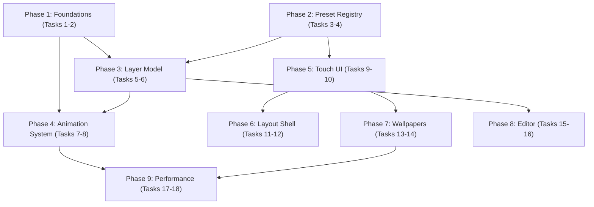

# Implementation Plan: VDock UI Redesign

## Overview

Incremental delivery across the nine phases defined in the design document: Foundations,
Preset registry, Layer model, Animation system, Touch UI, Layout shell, Wallpapers, Editor,
and Performance. All work is frontend-only (Vue 3 + TypeScript + Pinia); the Python/Flask
backend is untouched. Every phase leaves the app working and shippable. Tasks are ordered so
that Phases 1–4 (the visible animation payoff) land before the structural Phases 5–9, per
the design document's dependency graph (`2 → 3`, `1 → 3`, `1,3 → 4`, `2 → 5`, `5 → 6`,
`5 → 7`, `3 → 8`, `4,7 → 9`).

## Task Dependency Graph



Phases 1–4 deliver the visible animation payoff and must land in order. Phases 5–9 are
structural and depend only on the phases indicated above; they can proceed in parallel with
each other once their prerequisites are met.

```json
{
  "waves": [
    { "wave": 1, "tasks": ["1", "2"], "phase": "Foundations" },
    { "wave": 2, "tasks": ["3", "4"], "phase": "Preset Registry" },
    { "wave": 3, "tasks": ["5", "6"], "phase": "Layer Model" },
    { "wave": 4, "tasks": ["7", "8"], "phase": "Animation System" },
    { "wave": 5, "tasks": ["9", "10", "15", "16"], "phase": "Touch UI + Editor" },
    { "wave": 6, "tasks": ["11", "12", "13", "14"], "phase": "Layout Shell + Wallpapers" },
    { "wave": 7, "tasks": ["17", "18"], "phase": "Performance + Final Integration" }
  ]
}
```

## Tasks

- [x] 1. Phase 1 — Foundations: easing tokens and brand-parametric effects
  - [x] 1.1 Add shared easing tokens to `main.css`
    - Define `--ease-out: cubic-bezier(0.22, 1, 0.36, 1)`, `--ease-spring: cubic-bezier(0.34, 1.56, 0.64, 1)`, `--ease-io: cubic-bezier(0.4, 0, 0.2, 1)` in `assets/styles/main.css`
    - _Requirements: 7.1_

  - [x] 1.2 Retune the existing page-slide transition
    - Update `page-slide-left` / `page-slide-right` in `DashboardView.vue` to use `var(--ease-io)`, duration 340ms, travel distance 34% of viewport width
    - _Requirements: 7.2_

  - [x] 1.3 Add `--btn-brand` custom property and brand-parametric effect classes
    - Set `--btn-brand` on `.deck-button` derived from `layers.effect.tint` or preset `brand.primary` (preset wiring lands in Phase 2/3; for now accept an explicit prop/attr as the source)
    - Rewrite `.fx-glow`, `.fx-neon`, `.fx-emissive`, `.fx-shimmer` (or their current class names) to use `color-mix(in srgb, var(--btn-brand) X%, ...)` instead of hardcoded hex values
    - Implement the documented fallback: when `--btn-brand` is unresolved, fall back to the existing default hardcoded colour for that effect type
    - _Requirements: 3.1, 3.2, 3.4_

  - [x]* 1.4 Write property test for brand tint resolution and fallback (Property 6)
    - **Property 6: Brand tint resolves with correct precedence and fallback**
    - **Validates: Requirements 3.1, 3.4**

  - [x]* 1.5 Write property test for brand-parametric CSS classes (Property 7)
    - **Property 7: Brand-parametric effect classes never hardcode colour**
    - **Validates: Requirements 3.2**
    - Implemented via static parsing of the effect class CSS source, not component mounting

  - [x]* 1.6 Write property test for shared easing token usage (Property 11)
    - **Property 11: New animation declarations use shared easing tokens**
    - **Validates: Requirements 7.3**
    - Implemented via static parsing of new `transition` / `animation-timing-function` declarations introduced in this feature's CSS changes

- [x] 2. Checkpoint — Foundations
  - Ensure the app builds, the retuned page-slide transition plays correctly, and existing effects still render with their current default colours when no brand tint is supplied. Ask the user if questions arise.

- [ ] 3. Phase 2 — Preset registry
  - [x] 3.1 Define preset types and registry scaffolding
    - Create `frontend/src/data/presets/types.ts` with the `ButtonPreset` and `PresetCategory` interfaces from the design document
    - Create `frontend/src/data/presets/index.ts` exporting the combined registry, a category lookup, and a keyword/name match function
    - _Requirements: 1.1, 1.5, 1.6_

  - [x] 3.2 Migrate existing system actions into `system.ts`
    - Create `frontend/src/data/presets/system.ts` migrating the existing system/audio/media/window action presets out of the `createPreconfiguredButton` switch statement in `DashboardView.vue`
    - _Requirements: 1.1, 1.2_

  - [x] 3.3 Seed ~60 app presets in `apps.ts`
    - Create `frontend/src/data/presets/apps.ts` seeding presets from the 35 existing logos in `public/logos/` plus additional well-known apps to reach at least 60 entries
    - Include a `news` category with N12, Ynet, Walla, Mako, Sport1, ONE, Geektime, TGSpot, Lastartup, and Letsai
    - Assign each preset to one of `recent`, `ai`, `dev`, `media`, `social`, `news`, `system`
    - _Requirements: 1.3, 1.4, 1.5_

  - [x]* 3.4 Write property test for preset category validity (Property 1)
    - **Property 1: Preset categories are always valid**
    - **Validates: Requirements 1.5**

  - [x]* 3.5 Write property test for keyword discoverability (Property 2)
    - **Property 2: Preset keyword discoverability**
    - **Validates: Requirements 1.6**

  - [x] 3.6 Implement `presetToButton(preset, position)`
    - Add `presetToButton` to `frontend/src/data/presets/index.ts`, generating a fresh `id`, deriving `layers.icon` from `preset.icon`, `layers.effect.tint` from `preset.brand.primary` (unless the preset overrides it), and copying `preset.action`
    - Ensure the function does not mutate `preset` or any registry entry
    - _Requirements: 1.7_

  - [-]* 3.7 Write property test for presetToButton purity and correctness (Property 3)
    - **Property 3: presetToButton is pure and correctly derived**
    - **Validates: Requirements 1.7, 8.7**

  - [-] 3.8 Replace `createPreconfiguredButton` call sites with `presetToButton`
    - Remove the ~640-line `switch` statement in `DashboardView.vue`
    - Update all call sites to use `presetToButton(preset, position)` against the new registry
    - _Requirements: 1.2_

- [ ] 4. Checkpoint — Preset registry
  - Ensure every existing system action and app preset still creates a working button, and `DashboardView.vue` no longer contains the hardcoded switch statement. Ask the user if questions arise.

- [ ] 5. Phase 3 — Button layer model
  - [ ] 5.1 Add `ButtonLayers` type and extend `Button`
    - Add `ButtonLayers`, `IconType`, `IconLoop`, and `BehaviourType` to `frontend/src/types/index.ts`
    - Add optional `layers?: ButtonLayers` to the existing `Button` interface without altering any existing field
    - _Requirements: 2.1, 2.2_

  - [ ] 5.2 Implement `resolveButtonVisual(button)`
    - Add a pure function that resolves any `Button` (with or without `layers`) into an explicit `{ fill, effect, icon, label }` description
    - For each of the four slots, use the `layers` field when set, falling back to the corresponding legacy field (`icon`, `media_url`/`media_type`, `style`) when unset
    - Guarantee no slot ever resolves to `undefined`
    - _Requirements: 2.3, 2.4, 2.6_

  - [ ]* 5.3 Write property test for total, precedence-respecting visual resolution (Property 4)
    - **Property 4: Visual resolution is total and respects layer-over-legacy precedence**
    - **Validates: Requirements 2.3, 2.4, 2.6**

  - [ ] 5.4 Rewrite `DeckButton.vue` to render from `resolveButtonVisual`
    - Replace direct reads of `icon` / `media_url` / `style` with the resolved visual description
    - Render the Effect_Layer behind the Icon_Layer simultaneously when both are present
    - _Requirements: 2.3, 2.4, 2.5_

  - [ ] 5.5 Implement the 7 new CSS effect classes (fire, plasma, particles, aurora, scanline, rain)
    - Add CSS-only implementations wired through the brand-parametric pattern from task 1.3
    - _Requirements: 2.4 (effect layer support), 3.1, 3.2_

  - [ ] 5.6 Implement lazy `layers` write-on-save without touching untouched buttons
    - When a button is edited through the layer-aware editor and saved, write its `layers` field to the profile
    - Ensure buttons not edited in the same save operation remain byte-for-byte unchanged
    - _Requirements: 2.7_

  - [ ]* 5.7 Write property test for save isolation (Property 5)
    - **Property 5: Saving edited buttons never alters untouched buttons**
    - **Validates: Requirements 2.7**

  - [ ]* 5.8 Write property test for legacy profile backward compatibility (Property 24)
    - **Property 24: Legacy profiles load and render without error**
    - **Validates: Requirements 2.3, 14.1, 14.3**

  - [ ]* 5.9 Write property test for load-never-writes (Property 25)
    - **Property 25: Loading a profile never triggers a write**
    - **Validates: Requirements 14.2**

  - [ ] 5.10 Regression-check the 10 existing effects, 10 existing animations, and 10 existing backgrounds
    - Manually verify each pre-existing effect/animation/background still renders correctly through the new `resolveButtonVisual` path
    - _Requirements: 14.4_

- [ ] 6. Checkpoint — Layer model
  - Ensure all buttons (legacy and layer-based) render correctly, no existing profile fails to load, and the profile-save path only touches edited buttons. Ask the user if questions arise.

- [ ] 7. Phase 4 — Animation system
  - [ ] 7.1 Implement per-icon loop animations
    - Add CSS keyframes for `squash`, `bob`, `spin`, `pulse`, `swing`, `flip`, `jump`
    - Implement the phase-offset function `(index * 137) % 1900` ms and apply it per button via inline `animation-delay`
    - Gate all loop animations on `prefers-reduced-motion`
    - _Requirements: 4.1, 4.2, 4.3, 4.4_

  - [ ]* 7.2 Write property test for deterministic phase offset (Property 8)
    - **Property 8: Icon loop phase offset is a deterministic function of grid index**
    - **Validates: Requirements 4.2, 4.3**

  - [ ] 7.3 Implement `computeStaggerOrder(rows, cols, order)`
    - Implement `by-column`, `by-row`, `diagonal`, `random`, and `none` stagger orders, each returning a permutation of `[0, rows*cols)`
    - _Requirements: 5.3, 5.5_

  - [ ]* 7.4 Write property test for stagger order permutation correctness (Property 10)
    - **Property 10: Grid transition stagger order is always a permutation of grid cells**
    - **Validates: Requirements 5.1, 5.4, 5.5**

  - [ ] 7.5 Implement `useGridTransition.ts` composable and Grid_Transition styles
    - Create `frontend/src/composables/useGridTransition.ts` orchestrating the scale-out/light-bar-sweep/scale-in sequence described in the design document
    - Implement the `light-bar`, `flip`, `iris`, `cascade`, `glitch`, and `dissolve` styles
    - Wire the transition to fire on page or scene change
    - _Requirements: 5.1, 5.2_

  - [ ] 7.6 Implement `DeckOverlay.vue` ambient overlay component
    - Compute per-key transform offset as `translate(-col*(cellW+gap), -row*(cellH+gap))`
    - Support `keys` and `full-bleed` modes and the `light-sweep`, `aurora`, `plasma`, `rainbow`, `fire-wall`, `scanline`, `rain` styles
    - Handle the zero-button/zero-row/zero-col grid case without throwing
    - _Requirements: 6.1, 6.2, 6.3, 6.5_

  - [ ]* 7.7 Write property test for overlay geometry correctness (Property 13)
    - **Property 13: Ambient overlay per-key offset matches grid geometry**
    - **Validates: Requirements 6.1, 6.5**

  - [ ] 7.8 Implement tap-triggered ripple on the ambient overlay
    - On tap, render a ripple originating from the exact tap coordinate within the grid
    - _Requirements: 6.4_

  - [ ]* 7.9 Write property test for ripple origin correctness (Property 14)
    - **Property 14: Overlay ripple originates at the tap point**
    - **Validates: Requirements 6.4**

  - [ ] 7.10 Wire `prefers-reduced-motion` to disable all three animation layers
    - Icon_Loop → disabled; Grid_Transition → plain fade, no stagger; Ambient_Overlay → disabled
    - _Requirements: 4.4, 5.6, 6.6_

  - [ ]* 7.11 Write property test for reduced-motion override across all animation layers (Property 9)
    - **Property 9: Reduced motion disables every animation layer introduced by this redesign**
    - **Validates: Requirements 4.4, 5.6, 6.6, 12.8**

  - [ ] 7.12 Enforce transform/opacity-only animation and `will-change` lifecycle discipline
    - Audit all new keyframes/transitions introduced in this phase to animate only `transform` and `opacity`
    - Apply `will-change` only during an active transition and remove it immediately after
    - _Requirements: 12.5, 12.6_

  - [ ]* 7.13 Write property test for transform/opacity-only animation (Property 20)
    - **Property 20: New animations touch only transform and opacity**
    - **Validates: Requirements 12.5**

  - [ ]* 7.14 Write property test for will-change lifecycle (Property 21)
    - **Property 21: will-change is applied only during an active transition**
    - **Validates: Requirements 12.6**

- [ ] 8. Checkpoint — Animation system
  - Ensure per-icon loops, grid transitions, and the ambient overlay all run simultaneously without conflicting, and that `prefers-reduced-motion` disables all three. Ask the user if questions arise.

- [ ] 9. Phase 5 — Touch UI
  - [ ] 9.1 Build `QuickAddPicker.vue` structure
    - Create `frontend/src/components/QuickAddPicker.vue` with a vertical category rail (7 categories) on the left and an icon grid on the right
    - Default to the `recent` category tab on open
    - Paginate presets into pages of at most 15 with horizontal swipe and dot indicators
    - _Requirements: 8.4, 8.5, 8.6_

  - [ ]* 9.2 Write property test for picker pagination (Property 12)
    - **Property 12: Quick Add Picker pagination matches preset count**
    - **Validates: Requirements 8.6**

  - [ ] 9.3 Wire preset tap to add a fully configured button
    - On tap, call `presetToButton` and add the resulting button to the target grid cell in a single interaction
    - _Requirements: 8.7_

  - [ ] 9.4 Add on-screen keypad for unavoidable text entry
    - For custom URL/shell-command actions, present an on-screen keypad instead of assuming a hardware keyboard
    - _Requirements: 8.8_

  - [ ] 9.5 Remove keyboard search from the primary flow
    - Remove the `Search actions…` input from `DashboardView.vue`
    - Remove `QuickSearch.vue` from the primary button-adding flow; wire empty-cell taps to open `QuickAddPicker` instead
    - Remove the `fuse.js` dependency from `frontend/package.json` once no longer referenced
    - _Requirements: 8.1, 8.2, 8.3, 8.9_

  - [ ] 9.6 Extract `useButtonActions.ts` composable
    - Create `frontend/src/composables/useButtonActions.ts` containing the click / edit / copy / delete handlers currently inlined in `DashboardView.vue`
    - _Requirements: 11.2_

  - [ ] 9.7 Extract `DeckHeader.vue`, `DeckFooter.vue`, `WidgetColumn.vue`, `EditSidebar.vue`, `DeckOverlay.vue` from `DashboardView.vue`
    - Move the corresponding markup and logic out of `DashboardView.vue` into the five dedicated components, preserving existing behavior
    - _Requirements: 10.5, 11.1_

  - [ ]* 9.8 Write property test for minimum touch target on new interactive elements (Property 22)
    - **Property 22: New interactive elements meet the minimum touch target**
    - **Validates: Requirements 13.1**

- [ ] 10. Checkpoint — Touch UI and decomposition
  - Ensure adding a button via `QuickAddPicker` works end-to-end with no keyboard interaction required, and `DashboardView.vue` has shrunk toward its target size with no feature regressions. Ask the user if questions arise.

- [ ] 11. Phase 6 — Layout shell
  - [ ] 11.1 Implement `DeckHeader.vue` auto-hide behavior
    - Render avatar, current scene name, and edit toggle; auto-hide and reveal on swipe-down or tap
    - _Requirements: 10.1, 10.2_

  - [ ] 11.2 Implement `DeckFooter.vue`
    - Render page dots on the left and scene pills on the right
    - _Requirements: 10.3_

  - [ ] 11.3 Implement `WidgetColumn.vue`
    - Render clock, weather, and calendar widgets
    - _Requirements: 10.4_

  - [ ] 11.4 Wire the layout shell into `DashboardView.vue` at the 1024×600 target resolution
    - Assemble `DeckHeader`, `DeckFooter`, `WidgetColumn`, and the button grid into the layout described in the design document, with no horizontal or vertical overflow
    - _Requirements: 13.3_

  - [ ]* 11.5 Write property test for no-overflow across grid configurations (Property 23)
    - **Property 23: No overflow at the target viewport across grid configurations**
    - **Validates: Requirements 13.3**

- [ ] 12. Checkpoint — Layout shell
  - Ensure the full layout shell renders correctly at 1024×600 across a range of grid sizes and scene/page counts with no overflow. Ask the user if questions arise.

- [ ] 13. Phase 7 — Wallpapers
  - [ ] 13.1 Define `Wallpaper` type and registry
    - Create the `Wallpaper` interface and a wallpaper registry module mirroring the preset registry pattern
    - Migrate the existing ~19 background components (10 WebGL/canvas + ~9 CSS-only) into registry entries
    - _Requirements: 9.1, 9.2_

  - [ ]* 13.2 Write property test for wallpaper kind validity (Property 15)
    - **Property 15: Wallpaper kinds are always valid**
    - **Validates: Requirements 9.2**

  - [ ] 13.3 Replace `backgroundPreference` union type with registry lookup in `stores/settings.ts`
    - Change `backgroundPreference` to a plain `string` (a `Wallpaper.id`), resolved against the registry
    - Implement fallback to `'none'` when the stored id does not match any registered wallpaper
    - _Requirements: 9.1, 9.8_

  - [ ]* 13.4 Write property test for unknown wallpaper preference fallback (Property 18)
    - **Property 18: Unknown wallpaper preference falls back to none without throwing**
    - **Validates: Requirements 9.8**

  - [ ] 13.5 Implement `VideoWallpaper.vue`
    - Looping, muted, `playsinline` `<video>` rendered in the same slot as the existing WebGL backgrounds
    - Pause on `document.visibilitychange` (hidden) or window blur; resume on visible/focused
    - _Requirements: 9.3, 9.4, 9.5_

  - [ ]* 13.6 Write property test for video wallpaper pause/resume round-trip (Property 16)
    - **Property 16: Video wallpaper playback pause/resume round-trips with visibility**
    - **Validates: Requirements 9.4, 9.5, 12.7**

  - [ ] 13.7 Implement animated GIF/APNG wallpaper support and upload wiring
    - Add GIF/APNG wallpaper kind support and wire wallpaper upload through the existing `/api/upload` route
    - _Requirements: 9.9_

  - [ ] 13.8 Build the touch wallpaper gallery with live animated thumbnails
    - Replace the text-based background dropdown in `SettingsView.vue` with a touch gallery showing live thumbnails
    - _Requirements: 9.6_

  - [ ] 13.9 Implement per-scene wallpaper with optional per-page override
    - Add wallpaper resolution logic: page override takes precedence over the scene's wallpaper
    - _Requirements: 9.7_

  - [ ]* 13.10 Write property test for per-page wallpaper override resolution (Property 17)
    - **Property 17: Page wallpaper override takes precedence over scene default**
    - **Validates: Requirements 9.7**

- [ ] 14. Checkpoint — Wallpapers
  - Ensure all migrated backgrounds still render, video wallpapers pause/resume correctly, and the wallpaper gallery + per-scene/per-page overrides work end-to-end. Ask the user if questions arise.

- [ ] 15. Phase 8 — Editor decomposition
  - [ ] 15.1 Extract `FillPanel.vue`, `EffectPanel.vue`, `IconPanel.vue`, `ActionPanel.vue`, `AdvancedPanel.vue`
    - Split `ButtonEditor.vue` into five tabbed panel components mirroring the `Button_Layers` stack (fill, effect, icon+label, action, advanced)
    - _Requirements: 11.3_

  - [ ] 15.2 Wire the tabbed panels into a decomposed `ButtonEditor.vue`
    - Reassemble the panels into `ButtonEditor.vue` (~250 lines), preserving every existing editing feature
    - _Requirements: 11.3, 11.4_

  - [ ] 15.3 Regression-check editor feature parity
    - Manually verify every editing capability available before decomposition (all effects, animations, action types, layer fields) is reachable and functional after decomposition
    - _Requirements: 11.4_

- [ ] 16. Checkpoint — Editor decomposition
  - Ensure `ButtonEditor.vue` is decomposed with no loss of functionality and the tab structure matches the layer model. Ask the user if questions arise.

- [ ] 17. Phase 9 — Performance mode
  - [ ] 17.1 Implement the three-tier `Performance_Mode` setting
    - Add `Full` / `Balanced` / `Performance` tiers to the settings store, defaulting to `Full` on desktop and `Performance` on detected Raspberry Pi-class hardware
    - _Requirements: 12.1, 12.2_

  - [ ] 17.2 Implement tier-gated overlay, blur, and wallpaper-gallery filtering
    - `Balanced`: cap Ambient_Overlay at 30fps, halve blur radii, exclude `cost: 'high'` wallpapers from the gallery
    - `Performance`: disable Ambient_Overlay, disable Icon_Loops, reduce Grid_Transitions to fade, restrict the gallery to `kind: 'css'` wallpapers
    - _Requirements: 12.3, 12.4_

  - [ ]* 17.3 Write property test for tier-based wallpaper gallery filtering (Property 19)
    - **Property 19: Performance tier filters the wallpaper gallery correctly**
    - **Validates: Requirements 12.3, 12.4**

  - [ ] 17.4 Ensure video/WebGL pause on window-hidden regardless of tier
    - Confirm the pause/resume behavior from task 13.5 applies uniformly across all three Performance_Mode tiers
    - _Requirements: 12.7_

  - [ ] 17.5 Profile the full feature set on target hardware
    - Measure frame rate with the Ambient_Overlay, Icon_Loops, Grid_Transitions, and a `webgl`-kind wallpaper active simultaneously under each tier; adjust thresholds if needed
    - _Requirements: 12.1, 12.2, 12.3, 12.4_

- [ ] 18. Final checkpoint — Full integration
  - Ensure all property and unit tests pass, the app builds without errors, all nine phases are wired together end-to-end, and no existing profile, effect, animation, or background has regressed. Ask the user if questions arise.

## Notes

- Tasks marked with `*` are optional and can be skipped for a faster MVP; they are all property-based test tasks in this plan.
- Each task references specific requirements for traceability back to `requirements.md`.
- Property tests use fast-check with a minimum of 100 iterations per property, tagged `Feature: vdock-ui-redesign, Property N: <property text>`.
- Checkpoints align with the design document's phase boundaries (Foundations → Preset registry → Layer model → Animation system → Touch UI → Layout shell → Wallpapers → Editor → Performance).
- The backend (`backend/`) requires no changes for this feature; no backend tasks are included.
