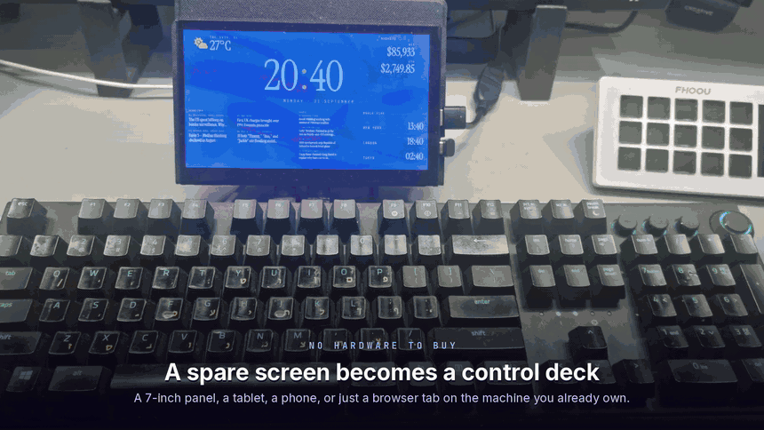
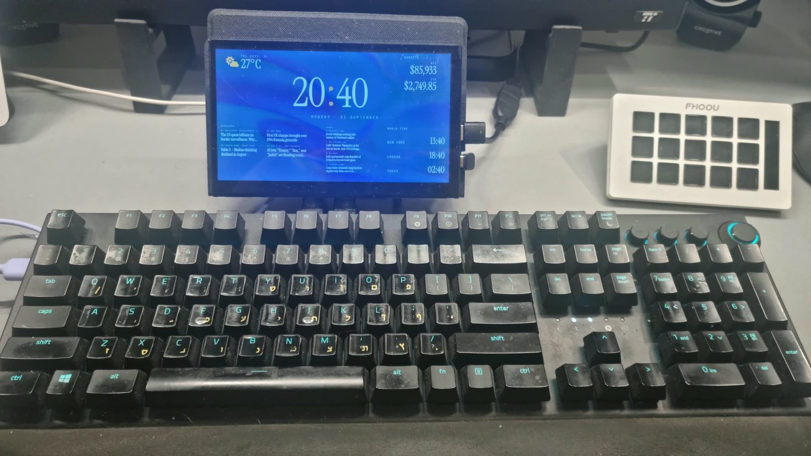
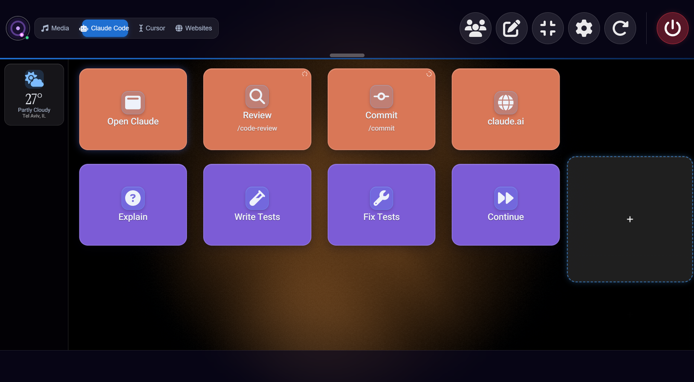
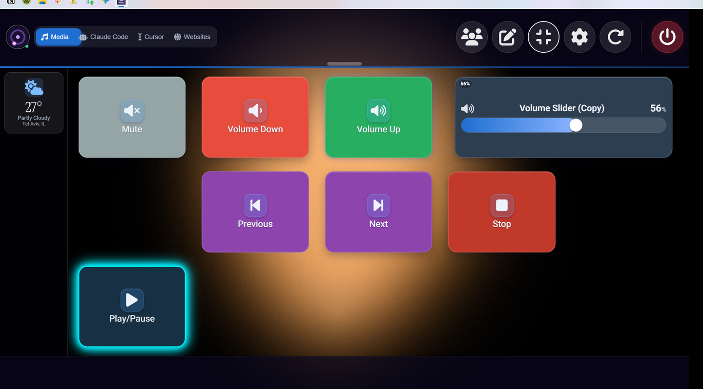
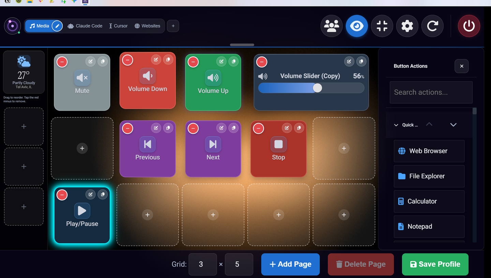
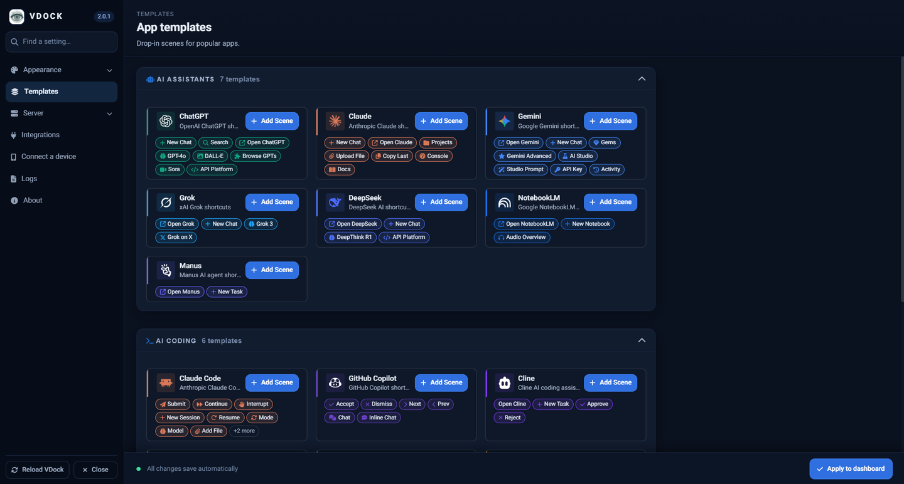
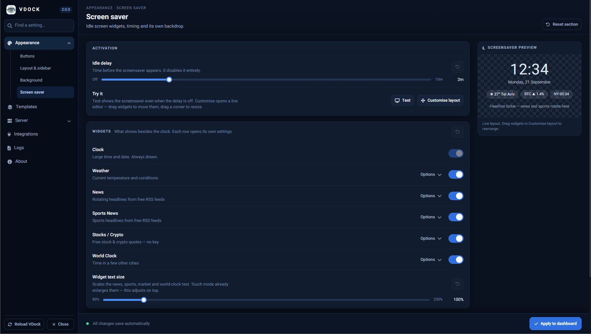

<div align="center">


### Your desktop. On real buttons.

**A free, open-source stream deck that runs on a screen you already own — and the only one that speaks fluent Claude Code.**



**▶ [Watch the full 70-second tour](docs/assets/vdock2-intro.mp4)** — 1080p, no sound

[](LICENSE)
[](#whats-new-in-20)
[](#requirements)
[](frontend/)
[](backend/)
[](#contributing)

[Quick start](#quick-start) · [Why VDock](#why-vdock) · [Use cases](#real-use-cases) · [Features](#features) · [What's new](#whats-new-in-20) · [Docs](docs/) · [Issues](https://github.com/ponya5/VDock2/issues)

</div>

---

## Contents

- [What is VDock?](#what-is-vdock)
- [Why VDock](#why-vdock)
- [Real use cases](#real-use-cases)
- [Quick start](#quick-start)
- [Features](#features)
- [What's new in 2.0](#whats-new-in-20)
- [Use it from your phone](#use-it-from-your-phone)
- [Configuration](#configuration)
- [Troubleshooting](#troubleshooting)
- [What VDock isn't (yet)](#what-vdock-isnt-yet)
- [Development](#development)
- [Contributing](#contributing)
- [License](#license)

---

## What is VDock?

A stream deck is a grid of physical buttons that fire the things you do all day — mute the mic, switch the scene, run the build. The good ones cost £150–£250 and lock you to one vendor's store.

**VDock is that deck, in software, for free.** Point any spare screen at it — a £30 USB touch panel, an old tablet, your phone, or just a browser tab — and you get a grid of buttons you design yourself.

<div align="center">

<br /><em>A 7-inch panel above the keyboard. No hardware from a vendor, no account, no subscription.</em>
</div>

Out of the box it ships **79 actions** across 11 categories — apps, hotkeys, media, system control, metrics, webhooks, sliders. It then **detects the tools already on your machine** and adds up to **160 more**, so a developer's install ends up with **239 actions** and a designer's install stays lean. Nothing is configured; nothing that can't run is offered.

What makes it different from every other deck is the last part: **VDock was built around AI coding agents.** Claude Code gets 40 actions of its own, a button that shows whether your session is actually alive, and a full-screen alert the moment your agent stops and waits for you.

---

## Why VDock

|  | VDock | Elgato Virtual SD | Touch Portal | WebDeck |
|---|---|---|---|---|
| **Price** | Free, MIT | Free **only if** you own Elgato hardware | Free tier is 4×2, 2 pages; Pro $13.99 | Free, GPLv3 |
| **Host OS** | Windows · macOS · Linux | Windows · macOS | Windows · macOS | **Windows only** |
| **AI agent actions** | **Claude Code (40), Copilot, Cursor, Devin, VS Code, JetBrains** | — | — | — |
| **Agent-waiting alerts** | **Yes** | — | — | — |
| **Ambient dashboard when idle** | **Yes** — clock, weather, news, markets | — | — | — |
| **Account required** | No | Yes | Yes | No |
| **Plugin marketplace** | Templates + scene packs | Large | **Largest** | Small |

**In one line:** free, agent-native, ambient, and yours — with an honest gap on ecosystem size that [we're upfront about below](#what-vdock-isnt-yet).

---

## Real use cases

### 1. Driving an AI coding agent without leaving the keyboard



The scene above is in the default profile. Tap **Review** and `/code-review` lands in your live Claude Code session — not a new one, the one you're already in. **Continue** resumes after a context compact. **Commit** runs `/commit`.

Two details that make this actually usable:

- **The green dot on the scene tab** means VDock can see the agent process running right now, so you know the button will land somewhere before you press it.
- **Agent attention alerts** — when Claude stops to ask permission or a question, VDock raises a pulsing amber card over everything, including the screensaver. You see it from across the room instead of finding it ten minutes later. One click in **Settings → Integrations** installs the Claude hook; any agent can drive it by POSTing to `/api/agent-events`.

### 2. A second screen that earns its desk space

Leave VDock idle and it becomes an ambient dashboard: clock, weather, rotating headlines, sports, live stock and crypto quotes, world clocks. **No API keys for any of it.** Drag widgets to rearrange them, drag a corner to resize.


### 3. Calls and recording

Mute, camera, push-to-talk (a button can fire on press and a different action on release), OBS scene switching, and a **volume slider you drag** rather than a button you tap eleven times.

### 4. Anything with an HTTP endpoint

One `http_request` action covers Home Assistant, n8n, Zapier, Discord webhooks, your own CI. Point a button at a JSON endpoint and show a value from the response **on the button face** — build status, queue depth, whatever you watch.

### 5. A phone as a spare deck

Settings → Server shows a QR code. Scan it from any phone on the same Wi-Fi and you have a second deck — [nothing to install](#use-it-from-your-phone).

### 6. A kiosk or workshop panel

Tablet touch mode, 44px minimum targets, and a first-run tour mean you can hand a panel to someone who has never seen it.

---

## Quick start

### Requirements

| Required | Version | Get it |
|---|---|---|
| Python | 3.9+ | [python.org](https://www.python.org/downloads/) — on Windows tick **"Add Python to PATH"** |
| Node.js | 18+ | [nodejs.org](https://nodejs.org/) |

Everything else is optional. VDock runs fully with none of the tools below installed — actions it can't run are greyed out **with the reason shown**, never hidden and never failing on press.

| Optional | Unlocks | Install |
|---|---|---|
| [Claude Code](https://claude.com/product/claude-code) | 40 Claude Code actions | `npm i -g @anthropic-ai/claude-code` |
| [GitHub CLI](https://cli.github.com) | PRs, issues, CI checks, live badges | `winget install GitHub.cli` → `gh auth login` |
| Git | Repo-aware actions | [git-scm.com](https://git-scm.com/) |

### Install

```bash
git clone https://github.com/ponya5/VDock2.git
cd VDock2
```

<details open>
<summary><strong>Windows</strong></summary>

Double-click **`setup.bat`**, or run it from a terminal. Choose **[1] Full setup**.

</details>

<details>
<summary><strong>macOS / Linux</strong></summary>

```bash
chmod +x setup.sh launch.sh
./setup.sh
```

</details>

Setup installs dependencies, creates a desktop shortcut, writes `backend/.env`, and reports which optional tools it found.

### Run

Double-click the **VDock** desktop shortcut, or run `launch.bat` / `./launch.sh`. Give it **5–10 seconds**, then it opens at **http://localhost:3000** (or the port you chose).

First launch walks you through a **13-step tour** — profiles, scenes, edit mode, the sidebar, settings, the screensaver — and drops you into a starter profile with four working scenes: **Media**, **Claude Code**, **Cursor** and **Websites**. Every button in it works with no keys and no config.

---

## Features

### The deck



| | |
|---|---|
| **Scenes & pages** | Multiple layouts per profile, page navigation, 6 transition styles, auto-switch to follow the focused app |
| **Docked sidebar** | Buttons that stay put across every page |
| **Sliders** | Drag or scroll for volume, brightness and VDock's own dimmer — merge two side-by-side sliders into one wide one |
| **Macros** | One press runs an ordered list of actions, each with its own delay |
| **Toggles** | Two-state buttons with their own icon, colour and label per state, synced across every open window |
| **Press vs release** | Fire on touch or on lift, with an optional second action on release — push-to-talk from a button |
| **Quick-deck overlay** | A floating mini deck over whatever you're doing: `` ` `` in the window, `Ctrl+Shift+D` globally in the desktop build |
| **Scene packs** | Export a scene as JSON and import it anywhere — buttons only, no settings, no secrets, safe to share |

### Build it



Tap the pencil, drag buttons around, resize the grid, search the action list, save. On a touch panel you drag with a finger. Changes save themselves.

### Integrations

| | |
|---|---|
| **Claude Code** | 40 actions — prompts, slash commands, session resume/rewind/compact, mode and model switches, approve/deny, todos, transcript. Uses your existing `claude` login |
| **GitHub** | `gh`-powered PRs, issues, checks, workflow runs — plus live PR count, CI status and notification badges on the button face |
| **Cursor · Copilot · VS Code · JetBrains · Visual Studio · Devin** | 102 more editor and agent commands, per-app keymaps |
| **OBS** | Scenes, sources, streaming controls |
| **HTTP / webhooks** | Any REST endpoint, any method, and a value from the JSON response rendered on the button |

> Keystroke actions only fire when the target editor is actually focused. That's deliberate — keys never land in the wrong window.

### Look and feel

 

| | |
|---|---|
| **10 button designs** | Classic, Glass, Glow Glass, Gem, Neon Rim, Watermark, Deck Key, Status Key, Full Art, Folder — picked from live swatches, not a dropdown |
| **16 overlay effects** | Fire, plasma, aurora, scanline, rain, holographic, metallic, liquid and more, on top of any design |
| **54 animated backgrounds** | Aurora, light rays, silk, iridescence, prism, ferrofluid… (60 catalogue entries with gradients and your own uploads), per-scene and per-app |
| **3 dashboard fonts** | Modern Sans, Editorial (Instrument Serif), Terminal Mono |
| **3 touch modes** | Normal 1.0× · Touch-Friendly 1.5× · Tablet 2.0×, with a 44px minimum target (WCAG 2.1 AA), auto-selected on small or touch screens |
| **Press feedback** | An optional synthesized click so a glass panel feels like it has keys |

### Templates



**36 ready-made scenes** across AI Assistants, AI Coding, AI Image & Video, Design & Creative, Automation & Dev, and AI Models & Platforms. One tap adds a working scene.

### Live widgets

CPU · RAM · GPU · disk · network · weather · world clock · timer · countdown · RSS news · sports · free stock and crypto quotes · spinner while an action runs · PR and CI badges.

---

## What's new in 2.0



**Settings, rebuilt.** Sidebar navigation instead of nested tab bars, a live preview rail beside the controls, search that jumps straight to the right page and scrolls to the setting, per-section reset, and a savebar that tells you the truth — changes save themselves, so there's no fake "unsaved" counter.

**Eight power features**, closing the gaps against Touch Portal and Elgato: macros, toggles, sliders, the quick-deck overlay, QR/LAN connect, press feedback, scene packs, and on-press/on-release triggers.

**Agent attention alerts** and the **scene live dot** — the two things that make an AI coding deck genuinely useful rather than a novelty.

**A first-run tour** and a starter profile that works with zero configuration.

**Under the hood:** auth on every API route, path-traversal containment, upload type whitelist, a 16MB request cap, a service worker that reloads onto new builds instead of serving stale ones, and frontend errors shipped to logs you can read in **Settings → Logs** and export as a zip.

---

## Use it from your phone

1. **Settings → Server → Connect a device**
2. Turn on **Allow LAN access**
3. **Relaunch VDock** — the bind address is chosen at startup
4. Scan the QR code, or type the `http://<your-lan-ip>:<port>` address shown next to it

No app to install; it's the same web UI. Two things to expect: the phone may need **one reload** the first time (the service worker serves its cached copy once, then updates), and on Windows you must **allow the firewall prompt for `python.exe` on private networks**.

LAN access is off by default and the QR encodes nothing but a local address.

---

## Configuration

| What | Where |
|---|---|
| Everything you'd normally change | **Settings** in the app — searchable, autosaving |
| Server config | `backend/data/config.json` (created on first run, gitignored) |
| Secrets | `backend/.env` (copy from `backend/.env.example`) |
| Ports | `setup.bat --ports` / `./setup.sh` option 4 |

### Optional API keys

You probably need none of these.

| Variable | Needed for | Note |
|---|---|---|
| `ANTHROPIC_API_KEY` | "Ask Claude (API)" only | The Claude **Code** actions use your existing `claude` login — no key |
| `GITHUB_TOKEN` | Live PR / CI / notification badges only | The `gh` actions use `gh auth login`. Needs `repo` + `notifications` |
| `VDOCK_DEFAULT_REPO_PATH` | Fallback repo when VDock can't infer one | Optional |

Secrets never reach the frontend — the action list exposes only *whether* an integration is configured, and secrets are stripped from command output before it reaches a notification or a log.

---

## Troubleshooting

| Problem | Try this |
|---|---|
| Python/Node not found | Reinstall with PATH enabled, restart the terminal |
| Port 3000 or 5000 in use | Change ports in setup, or close the other process |
| Setup failed on npm | Delete `frontend/node_modules`, run setup option **2** again |
| Desktop window doesn't open | Open **http://localhost:3000** in a browser |
| macOS blocks the launcher | Right-click `VDock.command` → **Open**, first time only |
| Claude / GitHub buttons greyed out | Hover for the reason — usually the CLI isn't installed or `gh auth login` hasn't run |
| Keystroke actions do nothing | They only fire when the target editor is focused. Deliberate |
| Phone can't reach VDock | Allow LAN access, **relaunch**, allow the Windows firewall prompt, reload the page once |
| UI looks like an old build | It self-heals on reload; if not, hard-refresh once |
| Something else | **Settings → Logs** — tail backend and frontend logs, or export them with your issue |

---

## What VDock isn't (yet)

Being straight about this, because a README that only lists wins isn't useful:

- **No plugin marketplace.** Touch Portal and Elgato have large third-party ecosystems. VDock has 36 templates and shareable scene packs, which covers most of it — but not all of it.
- **Shallow logic model.** Two-state toggles, yes. Global variables, events and conditionals like Touch Portal's? Not yet.
- **The global summon hotkey is desktop-only.** `Ctrl+Shift+D` from anywhere works in the Electron build. In a browser tab, `` ` `` only works while VDock has focus — browsers can't register OS-global hotkeys, and no amount of wanting changes that.
- **Mobile is the web UI over LAN, not a native app.** Zero install, but also no push notifications or background running.
- **macOS and Linux volume/brightness sliders** are implemented with the right fallbacks but have had less real-device testing than Windows. Reports welcome.

---

## Development

```bash
# Backend
cd backend
python -m venv venv
source venv/bin/activate         # Windows: venv\Scripts\activate
pip install -r requirements.txt
python app.py

# Frontend (second terminal)
cd frontend
npm install
npm run dev
```

```bash
# Tests
cd backend && pip install -r requirements-dev.txt && pytest
cd frontend && npm test
```

**Architecture:** Vue 3 + TypeScript front end, Python Flask + Socket.IO back end, Electron shell for the desktop build. Actions live in a catalog the frontend reads at runtime; integrations are self-detecting plugin packs under `backend/integrations/`.

Every change is written up in **[`design-log/`](design-log/)** — one numbered entry with the problem, the design, and how it was verified. Start there if you want to understand why something is the way it is. [`docs/development/DEVELOPER_GUIDE.md`](docs/development/DEVELOPER_GUIDE.md) covers adding an action type or writing an integration pack.

```
VDock2/
├── setup.bat / setup.sh      ← interactive installer
├── launch.bat / launch.sh    ← daily launcher
├── backend/                  ← Flask API, actions, integration packs
├── frontend/                 ← Vue 3 + TypeScript UI
│   └── electron/             ← desktop shell
├── design-log/               ← numbered design decisions
└── docs/                     ← guides and assets
```

---

## Contributing

Issues and pull requests are welcome — fork, branch, PR. Good first contributions: a new integration pack, an app template, a background, or a fix for something in [What VDock isn't](#what-vdock-isnt-yet).

If you're reporting a bug, **Settings → Logs → Export** gives you a zip worth attaching.

Security issues: please use [GitHub security advisories](https://github.com/ponya5/VDock2/security/advisories) rather than a public issue.

---

## License

MIT — see [LICENSE](LICENSE). Use it, fork it, ship it.

<div align="center">
<br />

**VDock2** · built by [Daniel Shalom (@ponya5)](https://github.com/ponya5)

If it saved you a click today, a ⭐ helps other people find it.

</div>
