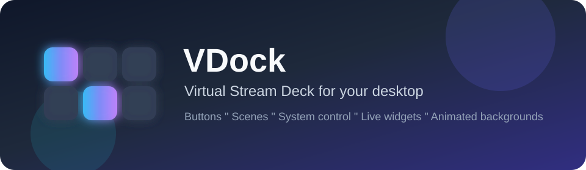
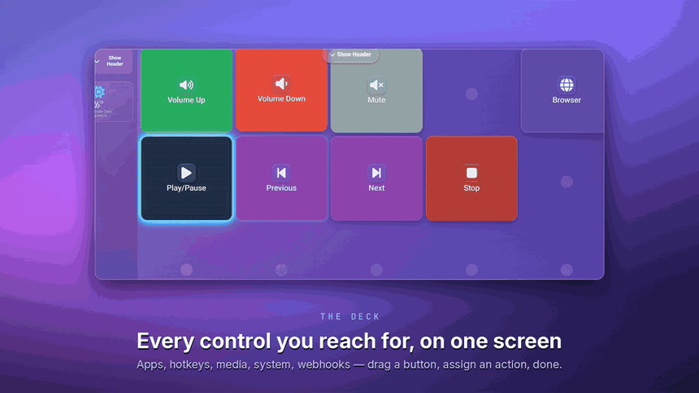
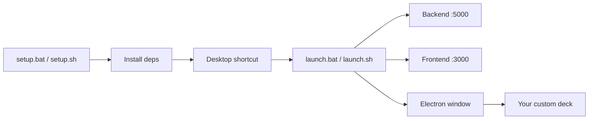
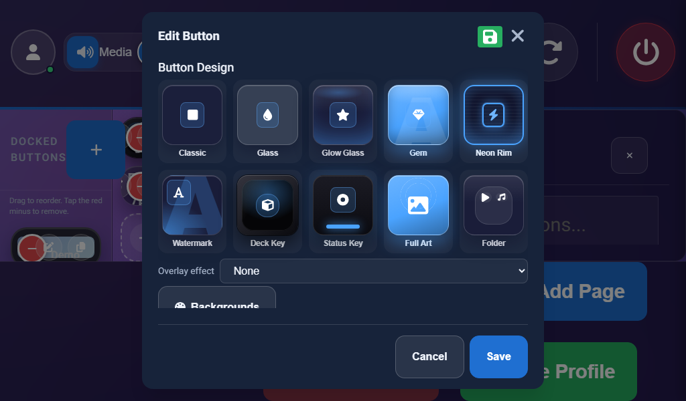
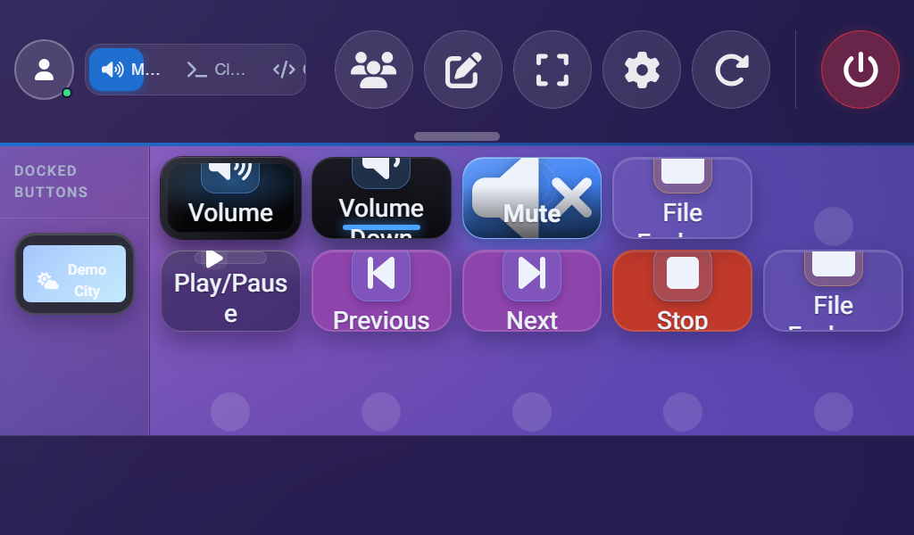
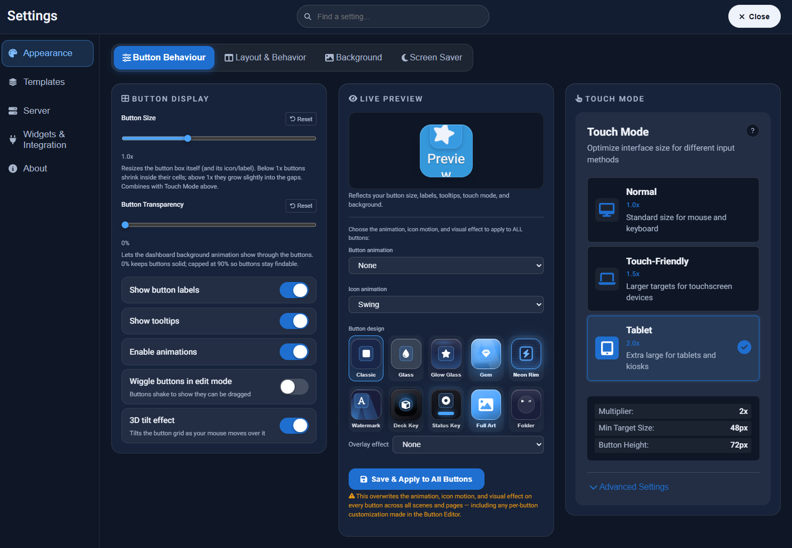
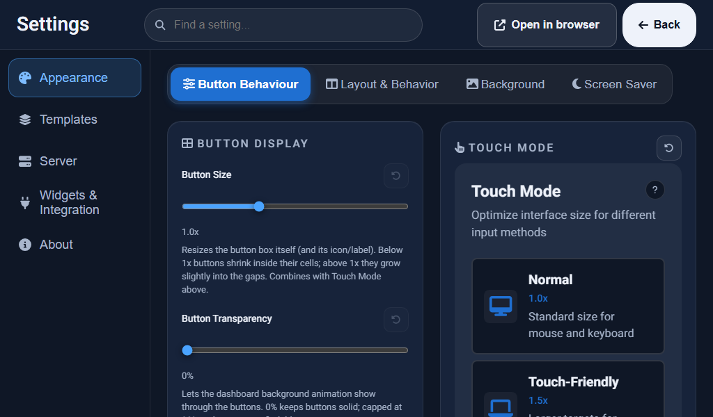

<div align="center">



<br />



<br />

**▶ [Watch the 40-second tour](docs/assets/vdock2-tour.mp4)** — 1080p, no sound

<br />

[](LICENSE)
[](#-whats-new-in-20)
[](README.md)
[](frontend/)
[](backend/)

**Your customizable control deck — drive Claude Code, GitHub, Cursor and Copilot from real buttons, alongside system actions, live widgets, and animated backgrounds.**

[Quick Start](#-quick-start) · [What's new in 2.0](#-whats-new-in-20) · [Features](#-features) · [Integrations](docs/INTEGRATIONS.md) · [Setup Menu](#-one-setup-for-everything) · [Creator](#-creator) · [Docs](docs/) · [Issues](https://github.com/ponya5/VDock2/issues)

</div>

---

## What is VDock?

VDock is a **virtual stream deck** for your computer — no hardware required.

Build button grids for everyday tasks (launch apps, hotkeys, volume, CPU/GPU
monitoring, OBS scenes, weather) **and for the work you actually do all day**:
run a Claude Code prompt, open a pull request, check CI, fire Cursor's Composer,
or POST to any webhook — all from a button.

**76 built-in actions** across 10 categories, plus up to **160 more** that appear
automatically when VDock detects the apps you already run — **236 actions across
12 categories** with everything installed. Use it as a **desktop app (Electron)**,
in your **browser**, or on a **7-inch touch panel** next to your keyboard.
Everything is editable: layouts, scenes, pages, icons, designs, backgrounds, and actions.



---

## 🆕 What's new in 2.0

### Ten deck-key designs — pick one, don't configure it

Every button can now wear a real design, chosen from a grid of **live swatches**
in the Button Editor instead of a text dropdown buried three fields down.

| | |
|---|---|
|  |  |

**Classic · Glass · Glow Glass · Gem · Neon Rim · Watermark · Deck Key · Status Key · Full Art · Folder**

Each one is brand-parametric — it picks up the button's own colour — and stacks
with any of **16 overlay effects** (fire, plasma, aurora, scanline, rain, holographic,
metallic, liquid, and more). Set one button, or hit **Save & Apply to All Buttons**
to push a design across every scene, page *and* the docked sidebar.

The **Button Size** slider now resizes the actual button box, not just the icon and
label inside it.

### Settings, rebuilt



- **Four Appearance sub-tabs** — Button Behaviour · Layout & Behavior · Background · Screen Saver
- **Live Preview** renders a real deck button through the actual component, so what you see can't drift from what ships
- **Find a setting** — search jumps straight to the right tab *and* sub-tab
- **Per-setting reset** — 27 reset icons, one source of truth for defaults
- **Session Logs** tab — browse and tail backend and frontend logs, colour-coded by level, exportable as a zip

### The screensaver became an editorial dashboard


Walk away and the deck turns into a display piece: **clock, weather, RSS headlines,
sports, stock & crypto quotes, and world clocks** — six widgets, **no API keys**
for any of them.

Drag any widget to move it, drag its corner to resize it, and save — all from a
live editor inside Settings. Widget config, delay and backgrounds now sit in their
own sub-tabs instead of one long scroll.

### Dashboard typography

The screensaver's editorial look is now available on the deck itself. Three
dashboard fonts — **Modern Sans** (Heebo), **Editorial** (Instrument Serif +
JetBrains Mono labels) and **Terminal Mono** (JetBrains Mono) — applied live,
with the Settings UI left alone.

### Built for the panel on your desk



The whole interface was redesigned around **1024×600**. Three touch modes —
**Normal (1.0×)**, **Touch-Friendly (1.5×)** and **Tablet (2.0×)** — with a
configurable minimum target size (44px default, WCAG 2.1 AA), auto-promoted when
VDock detects a small or touch screen.

### Under the hood

- **Security hardening** — every API route behind auth, path-traversal containment on static and upload routes, upload type whitelist, 16MB request cap
- **No more stale bundles** — the service worker now reloads the panel onto a new build instead of serving a cached one
- **Frontend errors captured** — Vue errors, unhandled rejections and `console.error` are shipped to the log files you can read in Settings
- **Smoother page transitions** — incoming buttons stay hidden until the reveal wave reaches them
- **In-app confirm dialogs** replacing native `confirm()`, so nothing blocks a kiosk screen

---

## ✨ Features

### Control deck
| | |
|---|---|
| 🎛️ **Custom grids** | Drag, resize, and arrange buttons freely |
| 🎬 **Scenes & pages** | Multiple layouts per profile with page navigation and 6 transition styles |
| 📌 **Docked sidebar** | Persistent buttons across all pages |
| 🎨 **10 button designs** | Live-swatch picker + 16 stackable overlay effects |
| 🧩 **Templates** | 42 app templates across 6 categories to get started fast |

### AI & developer integrations
| | |
|---|---|
| 🤖 **Claude Code** | 40 actions — prompts, slash commands (`/code-review`, `/commit`), session resume. Uses your existing `claude` login |
| 💬 **Claude API** | One-shot prompts straight to the clipboard (optional API key) |
| 🐙 **GitHub** | PRs, issues, checks, workflow runs via `gh` — plus live PR count, CI status and notification badges **on the button face** |
| ✨ **Cursor** | Composer, AI chat, inline edit, accept/reject diff |
| 🧑‍✈️ **GitHub Copilot** | Chat, inline suggestions, `/explain` `/fix` `/tests` `/doc` |
| 🧠 **VS Code · JetBrains · Visual Studio · Devin** | 79 more editor and agent commands, per-app keymaps |
| 🪝 **HTTP / webhooks** | Any REST endpoint — Discord, Slack, n8n, Zapier, Home Assistant — and show a value from the JSON response on the button |

> Integrations are optional and self-detecting. VDock works fully with none of
> them installed; actions it can't run are greyed out with the reason.

### Actions & automation
| | |
|---|---|
| ⌨️ **Hotkeys & macros** | Keyboard shortcuts and chained actions |
| 🖥️ **System control** | Volume, brightness, media, power, window management |
| 🚀 **Apps & URLs** | Launch programs, open sites, run commands |
| 🔀 **Toggles & random** | Two-state switches (mute/unmute) and shuffle keys |
| 🧭 **Scene navigation** | Jump to a page, switch scenes, auto-switch by focused app |
| 🎬 **OBS integration** | Scenes, sources, streaming controls |

### Live widgets
| | |
|---|---|
| 📊 **System metrics** | CPU, RAM, GPU, disk, network |
| 🌤️ **Weather** | Auto or manual city, no API key needed |
| 🕐 **Time widgets** | World clock, timer, countdown |
| 📰 **News & sports** | RSS/Atom headlines that rotate on the screensaver — no API key |
| 📈 **Markets** | Free stock and crypto quotes — no API key |
| 🔔 **Live button state** | Spinner while an action runs, badges for PR counts and CI status |

### Look & feel
| | |
|---|---|
| 🌈 **54 animated backgrounds** | Aurora, light rays, silk, iridescence, prism, ferrofluid, and more (60 catalogue entries with gradients and custom uploads) |
| 🖼️ **Custom wallpapers** | Upload dashboard and button backgrounds; per-scene and per-app backgrounds |
| ✍️ **3 dashboard fonts** | Modern Sans, Editorial, Terminal Mono |
| ✨ **Touch modes** | Normal, Touch-Friendly, and Tablet sizing |
| 🎞️ **Animated avatars** | GIF and Lottie profile avatars, plus static presets |
| 🌙 **Dark UI** | Polished dashboard with optional header and sidebar |

---

## 🚀 Quick Start

### Prerequisites

**Required**

| Requirement | Version | Download |
|-------------|---------|----------|
| Python | 3.9+ | [python.org](https://www.python.org/downloads/) |
| Node.js | 18+ | [nodejs.org](https://nodejs.org/) |

> **Windows:** During Python install, check **"Add Python to PATH"**.

**Optional — only for the integrations you want**

| Tool | Unlocks | Install |
|------|---------|---------|
| [Claude Code](https://claude.com/product/claude-code) | Claude prompt, slash command and session actions | `npm i -g @anthropic-ai/claude-code` |
| [GitHub CLI](https://cli.github.com) | PR, issue, checks and workflow actions | `winget install GitHub.cli` then `gh auth login` |
| Git | Repo-aware actions (branch, CI status) | [git-scm.com](https://git-scm.com/) |

Setup detects each of these and tells you what it found. Nothing here is
required to run VDock.

### 1. Get the code

```bash
git clone https://github.com/ponya5/VDock2.git
cd VDock2
```

Or download and extract the ZIP from GitHub.

### 2. Run setup (one menu for everything)

<details open>
<summary><strong>Windows</strong></summary>

Double-click **`setup.bat`** at the repo root, or run:

```cmd
setup.bat
```

</details>

<details>
<summary><strong>macOS / Linux</strong></summary>

```bash
chmod +x setup.sh launch.sh
./setup.sh
```

</details>

### 3. Launch

After setup, either:

- **Double-click the desktop shortcut** (`VDock` on Windows, `VDock.command` on macOS)
- Or run **`launch.bat`** (Windows) / **`./launch.sh`** (macOS/Linux)

Wait **5–10 seconds** for services to start. VDock opens at **http://localhost:3000** (or whichever port you chose during setup).

---

## 🧰 One setup for everything

The setup menu handles all first-run tasks:

```
========================================================
  VDock Setup
========================================================

  [1] Full setup (recommended)
      Install Python + Node deps, Electron, desktop shortcut,
      create backend/.env, detect integration CLIs

  [2] Install dependencies only
      Skip desktop shortcut creation

  [3] Create desktop shortcut only
      Adds a VDock icon to your Desktop

  [4] Configure ports
      Change which localhost ports VDock uses
      (useful if 3000/5000 are already taken by other apps)

  [5] Launch VDock now

  [6] Exit
```

**Non-interactive flags** (for scripts/CI):

```cmd
setup.bat --full       REM install + configure ports (kept as-is) + shortcut
setup.bat --deps       REM dependencies only
setup.bat --shortcut   REM desktop shortcut only
setup.bat --ports      REM change frontend/backend ports
setup.bat --launch     REM start VDock
```

---

## 📁 Project structure

```
VDock/
├── setup.bat / setup.sh     ← Start here (interactive installer)
├── launch.bat / launch.sh   ← Daily launcher
├── backend/                 ← Python Flask API
│   └── integrations/        ← Per-app action packs and keymaps
├── frontend/                ← Vue 3 + TypeScript UI
│   └── electron/            ← Desktop app shell
├── design-log/              ← Numbered design decisions (DL-001 …)
├── docs/                    ← Guides and assets
└── scripts/                 ← Maintainer build/deploy tools
    └── VDock-Launcher.py    ← Launcher engine
```

---

## ⚙️ Configuration

| What | Where |
|------|-------|
| App settings (UI) | **Settings** gear in the dashboard |
| Server config template | `backend/data/config.example.json` |
| Local server config | `backend/data/config.json` (created on first run, not in git) |
| Backend secrets | `backend/.env` (copy from `backend/.env.example`) |

### Settings panes

- **Appearance** — Button Behaviour, Layout & Behavior, Background, Screen Saver
- **Templates** — 42 one-click app decks
- **Server** — ports, auto-start on boot, open settings in a new browser tab
- **Widgets & Integration** — weather location, RSS news and sports feeds, market
  tickers, world clocks, auto scene switching per app
- **Logs** — tail, filter and export backend/frontend logs
- **About** — version and build info

### Optional API keys

Everything below is optional; the matching actions are greyed out with an
explanation until you set them. Edit `backend/.env`:

| Variable | Needed for | Notes |
|----------|-----------|-------|
| `ANTHROPIC_API_KEY` | "Ask Claude (API)" only | The Claude **Code** actions use your existing `claude` login and need no key |
| `GITHUB_TOKEN` | Live PR / CI / notification widgets only | The `gh` actions use your existing `gh auth login`. Needs `repo` + `notifications` scopes |
| `VDOCK_DEFAULT_REPO_PATH` | Fallback repo when VDock can't infer one | Optional |

> VDock never sends these to the frontend — the action list exposes only
> whether an integration is configured, and secrets are stripped from any
> command output before it reaches a notification or the log.

---

## 🔧 Troubleshooting

| Problem | Try this |
|---------|----------|
| Python/Node not found | Reinstall with PATH enabled, restart terminal |
| Port 5000 or 3000 in use | Close other Python/Node processes in Task Manager |
| Setup failed on npm | Delete `frontend/node_modules`, run setup option **2** again |
| Electron doesn't open | Open **http://localhost:3000** manually in your browser |
| macOS blocks launcher | Right-click `VDock.command` → **Open** the first time |
| Claude / GitHub buttons greyed out | Hover for the reason. Usually the CLI isn't installed or `gh auth login` hasn't been run |
| Keystroke actions do nothing | They only fire when the target editor is focused — this is deliberate, so keys never land in the wrong window |
| UI looks like an older build | It self-heals on reload now; if not, hard-refresh once to clear the old service worker |
| Something misbehaving | **Settings → Logs** — tail the backend and frontend logs, or export them with an issue |

More help: [`docs/QUICKSTART.md`](docs/QUICKSTART.md) · [`docs/INTEGRATIONS.md`](docs/INTEGRATIONS.md) · [`docs/setup/DESKTOP_LAUNCHER.md`](docs/setup/DESKTOP_LAUNCHER.md)

---

## 🛠️ Development

```bash
# Backend
cd backend
python -m venv venv
source venv/bin/activate   # Windows: venv\Scripts\activate
pip install -r requirements.txt
python app.py

# Frontend (separate terminal)
cd frontend
npm install
npm run dev
```

### Tests

```bash
# Backend (install test deps once)
cd backend && pip install -r requirements-dev.txt && pytest

# Frontend
cd frontend && npm test
```

See [`docs/development/DEVELOPER_GUIDE.md`](docs/development/DEVELOPER_GUIDE.md)
for architecture, how to add an action type, and how to write an integration
pack. Design decisions are logged in [`design-log/`](design-log/) — one numbered
entry per change, with the problem, the design and the verification.

---

## 👤 Creator

<div align="left">
  <a href="https://github.com/ponya5">
    
  </a>
</div>

<div align="center">


</div>

### Head of AI · Head of Delivery & QA | Site Management @ Securitize  
**AI Innovator · Multi-Agent Systems Builder · Automation Architect**

<p align="left">
  
  <b style="font-size: 1.35em; margin-left: 10px;">Let's Connect</b>
</p>

<p align="left">
  <a href="https://www.linkedin.com/in/daniel-shalom-13987a1a/"></a>
  <a href="https://github.com/ponya5"></a>
  <a href="https://www.daniel-shalom.com"></a>
  <a href="https://www.instagram.com/daniel.shalom.ai/"></a>
</p>

<p align="left">
  
  
  
  
  
</p>

> **VDock2** is a fun project by **[Daniel Shalom (@ponya5)](https://github.com/ponya5)** — part of a portfolio of automation tools, AI apps, and creative builds.  
> See more projects on [github.com/ponya5](https://github.com/ponya5).

---

## 📜 License

MIT — see [LICENSE](LICENSE).

## 🤝 Contributing

Issues and pull requests are welcome. Fork → branch → PR.

---

<div align="center">

**VDock2** — put your most-used controls one click away.

Built by [Daniel Shalom](https://github.com/ponya5)

</div>
