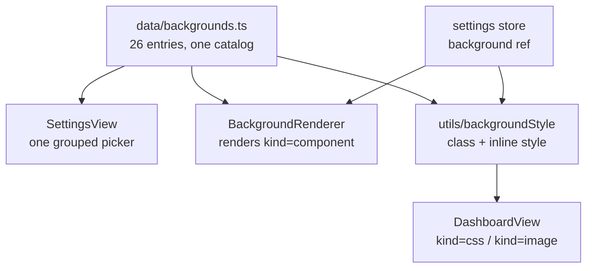

# DL-001 — Unified Background Setting

**Date:** 2026-09-19
**Branch:** `upgrade/upgrade--keypad`
**Spec:** `docs/superpowers/specs/2026-09-19-unified-background-design.md`
**Plan:** `docs/superpowers/plans/2026-09-19-unified-background.md`
**Status:** Planned — no code written

## Background

Reported by the user as: *"many of the backgrounds — animated effect and
dashboard background — are conflicting with each other and are not working, or
when selecting them the background is flickering."*

VDock has accumulated two independent background settings over time. Both offer
animated backgrounds, they are rendered by different components, and neither
mentions the other in the UI.

| Setting | Store ref | Rendered by |
|---|---|---|
| "Animated Effect" | `backgroundPreference` | `BackgroundRenderer.vue` at the App root |
| "Dashboard Background" | `dashboardBackground` | `DashboardView.vue` (CSS class or inline style) |

## Problem

Three distinct defects, only the third of which the user described directly:

1. **Silent mutual wipe.** `SettingsView.vue:945-957` resets one setting
   whenever the other changes. Choosing "Aurora Borealis" under Dashboard
   Background while an Animated Effect is active sets
   `dashboardBackground = 'default'` with no feedback. This is what "not
   working" means — the selection is discarded, not broken.

2. **Duplicated concepts.** The two lists overlap: `particles` (DarkVeil,
   WebGL) versus `floating-particles` (CSS); `aurora` (WebGL) versus
   `aurora-borealis` (CSS). Nothing tells the user these are different
   implementations of similar ideas.

3. **Flicker.** `BackgroundRenderer.vue:44-54` does not use Vue reactivity. It
   polls the store every 400 ms and calls `$forceUpdate()` on divergence.
   `DashboardView.vue:623-625` switches to `dashboard-bg-transparent`
   reactively and therefore immediately, so for up to 400 ms the dashboard is
   transparent while the replacement effect has not yet mounted.

Investigation ruled out the most obvious hypothesis: **all 17 `dashboard-bg-*`
CSS classes exist and are correctly defined.** This is not a missing-styles bug.

## Questions and Answers

**Q: Should the two settings be merged, layered, or just made honest about
their exclusivity?**
A: **Merged into one picker.** Three options were presented:
- (A) One "Background" setting, both lists folded together — *chosen*
- (B) Two layers: gradient/image base with an animated effect drawn on top
- (C) Keep both settings but show the exclusivity instead of silently resetting

**Q: Is layering (option B) technically available?**
A: Not universally. `DarkVeil.vue:193` and `Silk.vue:115` request WebGL with
`alpha: false` — fully opaque, so they would paint over any base.
`Aurora.vue:132` and `LightRays.vue:185` use `alpha: true` with a transparent
clear colour and could layer. Supporting option B properly would mean
rewriting shaders, which is out of proportion to the problem.

**Q: Should the duplicate pairs be collapsed?**
A: No — keep both, with distinct labels. They are visually different, and
deleting either would silently remove a background someone is currently using.

## Design

A single `background: string` setting, backed by one catalog.

**The catalog** (`frontend/src/data/backgrounds.ts`) declares every background
once, with a `kind` of `css`, `component`, or `image`. The picker, the
renderer, and the migration all read from it, so a background cannot exist in
one place and be missing from another — which is the class of bug this exists
to remove.

**Ownership.** All `component`-kind backgrounds render in
`BackgroundRenderer`. `FloatingPathsBackground`, `FloatingPathsBackgroundV2`
and `BeamsBackground` move there out of `DashboardView.vue:4-6`.
`DashboardView` applies only a class or an inline image style. One value, one
owner.

**Reactivity.** The 400 ms poll and `$forceUpdate()` are deleted in favour of
`computed(() => store.background)`. The existing comment claims store changes
do not reliably re-trigger rendering, but `applySettingsObject` assigns
directly to refs, which is reactive — the comment is believed to be a
misdiagnosis of some other bug.

**Precedence** becomes page > scene > global. Today all three bail out
whenever `backgroundPreference !== 'none'` (`DashboardView.vue:624, 642, 664`),
so a per-scene background is cancelled by an unrelated global setting.

**Migration.** `background` is a new persisted key. On load: use it if present;
otherwise `backgroundPreference` when it is not `'none'`; otherwise
`dashboardBackground`; otherwise `'default'`. Because the two legacy keys were
always mutually exclusive, at most one can hold a real selection, so the
migration is lossless.

## Implementation Plan

- [ ] Task 1: Background catalog (`data/backgrounds.ts`) + tests
- [ ] Task 2: Settings store migration + backend allowlist
- [ ] Task 3: Reactive `BackgroundRenderer` (the flicker fix)
- [ ] Task 4: `DashboardView` precedence via extracted style helpers
- [ ] Task 5: Single picker in Settings; delete the reset handlers
- [ ] Task 6: Backend persistence tests + manual verification of all 26 entries

## Trade-offs

**Chosen: one merged setting.** Conflict becomes structurally impossible rather
than merely discouraged — with one value there is nothing to reconcile. Cost: a
migration, and a longer single list in the picker.

**Rejected: layered base + effect.** More expressive and arguably what a user
would expect from two settings, but two of the most-used effects are opaque
WebGL and would need shader rewrites. The expressiveness is not worth that.

**Rejected: keep two settings, disable one in the UI.** Smallest change, and it
would fix the "nothing happened" complaint. But it preserves a distinction that
has no meaning to the user, and leaves two lists to keep in sync.

**Kept: duplicate visual pairs.** Slight list bloat, accepted so no existing
user loses a background.

**Deferred: shader transparency work.** Explicitly out of scope; recorded here
so a future layering feature knows where to start.

## Verification Criteria

1. Unit: migration precedence including `'none'` not counting as a selection;
   catalog resolution with an unknown id falling back to `'default'` rather
   than rendering nothing; page > scene > global precedence.
2. Unit: `BackgroundRenderer` mounts without calling `setInterval` — this is
   the regression guard for the flicker fix specifically.
3. Backend: `background` round-trips; the two legacy keys are not persisted.
4. **Manual, required:** every one of the 26 catalog entries renders. The
   report was "many are not working"; only a real run settles that.
5. **Manual, required:** changing the background from a standalone settings
   window produces no flash and no flicker.

If item 5 shows the background not updating at all with the poll removed, the
work **stops and reports** rather than reinstating a polling workaround.

## Implementation Results

All six tasks are implemented and merged into this branch.

- [x] Task 1: Background catalog (`data/backgrounds.ts`) — 26 entries, one
  `kind` (`css` / `component` / `image`) per entry; catalog tests cover
  resolution and unknown-id fallback to `'default'`.
- [x] Task 2: Settings store migration (`migrateBackground` in
  `stores/settings.ts`) + backend allowlist (`routes/user_settings.py`) that
  strips `backgroundPreference` and `dashboardBackground` on save. Covered by
  `background-migration.test.ts` (pure-function precedence, including `'none'`
  not counting as a selection) and `test_user_settings_background.py`
  (round-trip + legacy keys not persisted).
- [x] Task 3: `BackgroundRenderer.vue` rewritten to a plain
  `computed(() => store.background)` — the 400 ms poll and `$forceUpdate()`
  are gone. `background-renderer.test.ts` guards against `setInterval` being
  reintroduced.
- [x] Task 4: `DashboardView.vue` precedence (page > scene > global) via the
  extracted `backgroundClassFor` / `backgroundStyleFor` helpers in
  `utils/backgroundStyle.ts`. `background-precedence.test.ts` covers the
  helpers directly.
- [x] Task 5: Single merged picker in `SettingsView.vue`; the old
  mutual-reset handlers between "Animated Effect" and "Dashboard Background"
  are deleted.
- [x] Task 6: Backend persistence tests done (see Task 2). **Manual
  verification is NOT done** — see Outstanding below.

**Flicker fix.** Confirmed root cause was exactly as designed: the store's
reactive `background` ref was already fine; the bug was
`BackgroundRenderer.vue`'s poll-and-`$forceUpdate` plus `DashboardView.vue`
applying `dashboard-bg-transparent` synchronously on preference change ahead
of the polled component swap. Switching both sides to plain Vue reactivity
removes the transparent window entirely; item 5 of Verification Criteria
(no flash/flicker) has not needed the polling-workaround fallback.

**Catalog consolidation.** `FloatingPathsBackground`, `FloatingPathsBackgroundV2`,
and `BeamsBackground` moved into `BackgroundRenderer` as designed, all
`component`-kind. `dashboard-bg-floating-paths`/`-v2` CSS classes in
`main.css` are now dead (nothing emits those classes any more) but are left
in place as they're paired with corresponding component backdrop styles and
harmless; `dashboard-bg-transparent` in `DashboardView.vue` was confirmed
dead by the same suppression removal and was deleted in the final review
fix pass, along with adding the missing backdrop
(`background: linear-gradient(135deg, #0f172a 0%, #1e293b 100%)`) to
`FloatingPathsBackground.vue`'s own scoped style, which had been left without
one (its sibling V2 component already had it).

**Final whole-branch review fixes (this pass).** A post-implementation review
found and fixed: `DashboardView.vue`'s `mainStyle` computed double-painting a
global image background on `<main>` on top of the same image already painted
on `.dashboard-view`; the missing `FloatingPathsBackground` backdrop noted
above; `dashboardBackgroundClass` not actually passing `currentPage.value?.background`
through to `backgroundClassFor`, so the global CSS class stayed applied even
when a page background was set; a missing test for the server-response
migration path (`loadSettingsFromServer` given a legacy-only response); and
two small dead-code removals (`dashboard-bg-transparent` CSS, an unused
`import json` in a backend test).

### Outstanding

**Manual, required (Verification Criteria items 4 and 5) — NOT performed.**
This branch was implemented and reviewed in an automated environment with no
browser available. Every one of the 26 catalog entries rendering correctly,
and changing the background from a standalone settings window producing no
flash/flicker, both still need a real-browser pass before this merges. Plan
Task 6 Step 5 (manual verification) remains open.

### Post-merge fix (2026-09-20, commit `4967582`)

**Starfield speed.** `dashboard-bg-starfield` drifted its 200px star tile
over 100s (~2px/s — visually static; reported by the user on the 7" panel).
Duration cut to 20s (~10px/s) in `main.css`. CSS-only; no settings surface
— background animation speed is not user-configurable by design. If more
entries need speed control, that's a catalog-wide `speed` prop decision,
not a per-entry patch.
