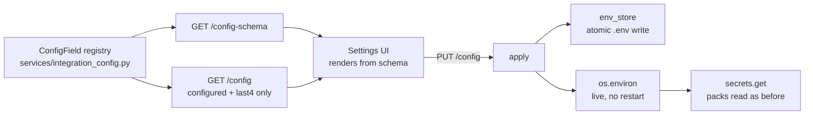

# DL-002 — Integrations Configuration Surface

**Date:** 2026-09-19
**Branch:** `upgrade/upgrade--keypad`
**Spec:** `docs/superpowers/specs/2026-09-19-integrations-config-design.md`
**Plan:** `docs/superpowers/plans/2026-09-19-integrations-config.md`
**Status:** Planned — no code written
**Blocks:** DL-003, DL-004

## Background

Requested by the user while designing DL-004: *"add to configuration screen the
right screen/tab where I can add any key/path or param that is required to make
these features work. I don't want the user to add them into VDock code but as a
settings instead (save button will apply the changes)."*

The request arrived as a convenience requirement. Investigating it surfaced a
security problem that makes it a fix.

## Problem

### The leak

`SettingsView.vue:429` renders `marketApiKey` as a password input bound
directly into the Pinia store. That store:

- writes to `localStorage` (`settings.ts` `saveSettingsLocalOnly`),
- posts the payload over `BroadcastChannel` (`settings.ts:162`),
- emits it over the socket via `broadcastSettingsChange` (`settings.ts:163`),
  which `app.py:256` relays to every connected client.

`newsApiKey` does all of that **and** is allowlisted at `user_settings.py:42`,
so it is additionally written in plaintext to
`backend/data/user_settings.json`.

Meanwhile `services/secrets.py` opens by stating the opposite contract:

> Nothing here is ever serialised to the frontend: the action catalog exposes
> only a boolean saying whether an integration is configured.

Two competing conventions exist in the same codebase, and the leaky one is the
one that has a UI.

### The friction

`ANTHROPIC_API_KEY`, `GITHUB_TOKEN` and `WEATHERAPI_KEY` have no UI at all.
Configuring them means editing `backend/.env` and restarting. Every new
integration inherits that.

### Dead and orphaned keys

| Key | State |
|---|---|
| `newsApiKey` | Read by nothing since the GNews → RSS migration. Persisted in two places. |
| `marketApiKey` | Read by nothing. In `localStorage` only — not even in the backend allowlist. |
| `worldClockTimezones` | Allowlisted (`user_settings.py:43`), used by nothing. |
| `marketCoins` | Allowlisted (`user_settings.py:44`), used by nothing. |

The last two are reserved keys that DL-003 adopts rather than inventing new
names.

## Questions and Answers

**Q: Where should credentials be stored, now that a UI writes them?**
A: **`backend/.env` stays the store.** It is already gitignored
(`.gitignore:9`), already dotenv-loaded by `app.py`, and already what
`secrets.get()` reads via `os.environ`. Writing it from the UI means zero
change to how packs read credentials.

Rejected: a separate `credentials.json` — a second store to audit, and POSIX
file modes do not translate to Windows ACLs. Rejected: encryption at rest — the
key would itself have to live somewhere, and `.env` is already outside version
control. `secrets.py`'s docstring anticipates a keyring backend later; this
design does not close that door.

**Q: How do changes take effect without a restart?**
A: On save, write `.env` **and** set `os.environ[key]` in-process.
`secrets.get()` reads `os.environ`, so the next action execution picks it up.
No caching layer is introduced.

**Q: What does an untouched masked password field submit, and what should that
mean?**
A: It submits `""`. That is defined as a **no-op**, not a clear. A masked input
the user never focused must not wipe a working credential on save. Clearing is
an explicit `null` from a separate Clear button.

**Q: Should these routes respect `ALLOW_LAN`?**
A: No. They are **loopback-only unconditionally**. `Config.ALLOW_LAN` exists so
a tablet on the LAN can drive the deck; it is not a reason to expose key
management to the network.

## Design

**Storage** is `.env`, rewritten line-based rather than dump-and-reserialise so
comments, blank lines, key order and unmanaged keys all survive. Writes go to a
temp file in the same directory then `os.replace()`, so a crash cannot truncate
someone's real config.

**Two field classes.** `kind == 'secret'` is write-only over the wire: `GET`
returns `{configured, last4}` and never a value. Everything else — paths,
process lists, booleans — round-trips normally.

**Schema-driven UI.** The registry is served at `GET
/api/integrations/config-schema` and the Vue tab renders from it, so adding a
field for a future integration is a backend declaration with no frontend edit.
This is the same single-source-of-truth principle DL-004 applies to keymaps.

**Layout.** The existing `activeTab === 'integration'` tab
(`SettingsView.vue:538`) gains sub-tabs, mirroring how Appearance already
sub-divides: Credentials, Claude Code, Apps & Scenes, Data Sources.

**Save semantics.** Fields are component-local drafts; nothing is sent until
Save, which issues one `PUT` for all dirty fields and reports per-field results
so one bad value does not discard the rest. Secret values never enter the
settings store.

**Migration.** Any value found in `newsApiKey` / `marketApiKey` is offered for
migration into `.env`, then **deleted from `localStorage` and
`user_settings.json`** and dropped from the allowlist. Deleting is the point —
leaving the old values beside a new secure path would mean the leak still
exists.

## Implementation Plan

- [ ] Task 1: `services/env_store.py` — atomic, comment-preserving `.env` I/O
- [ ] Task 2: `ConfigField` registry; fold in `WEATHERAPI_KEY`, `FINNHUB_API_KEY`
- [ ] Task 3: The three routes, loopback-guarded
- [ ] Task 4: Frontend client + schema-driven settings sub-tabs
- [ ] Task 5: Remove the leaked keys and scrub existing stored values
- [ ] Task 6: Document in `.env.example` and `docs/INTEGRATIONS.md`; verify

## Trade-offs

**Chosen: `.env` as the store.** One place to audit, no change to how packs
read credentials, and it is already gitignored. Cost: plaintext on disk — which
is what it already was, and the machine-local threat model has not changed.

**Chosen: `""` means unchanged.** Slightly surprising as an API, but it is the
behaviour that prevents the realistic accident: pressing Save on a form with a
masked field you never touched.

**Chosen: loopback-only, ignoring `ALLOW_LAN`.** Deliberately inconsistent with
the rest of the API. Credential management is not a remote-control surface, and
`ALLOW_LAN` was never meant to cover it.

**Rejected: encryption at rest / OS keyring.** Real improvement, but it needs a
key-management story of its own. `secrets.py` is written to allow it later.

**Rejected: keeping `marketApiKey` as a compatibility shim.** It is dead code
that reads as a working feature. Removing it is part of the fix.

## Verification Criteria

1. `.env` round-trip preserves comments, blank lines, key order, and every
   unmanaged key.
2. A simulated failure mid-write leaves the original file byte-identical.
3. `GET /api/integrations/config` never contains a secret value — asserted on
   the serialised payload, not just the parsed object.
4. `""` is a no-op on a secret; `null` clears; an omitted key is unchanged.
5. A saved key is usable **without restarting the backend**.
6. Non-loopback callers are rejected with `ALLOW_LAN=True`.
7. **Manual, required:** after migration, neither
   `backend/data/user_settings.json` nor browser `localStorage` contains any
   credential.
8. **Manual, required:** a pre-existing `.env` keeps its comments and unrelated
   keys after a save from the UI.

## Implementation Results

*(Not started. Append below once coding begins; do not modify the sections
above.)*
