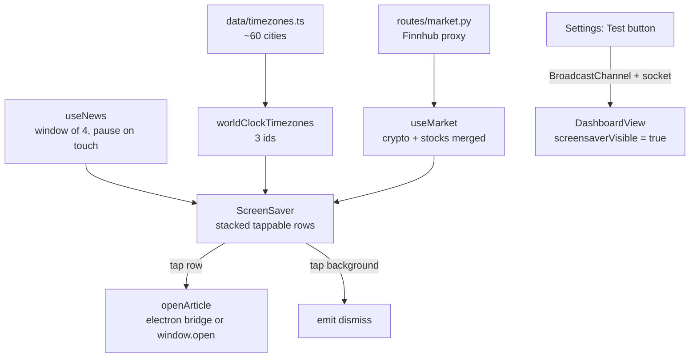

# DL-003 — Screensaver Rework

**Date:** 2026-09-19
**Branch:** `upgrade/upgrade--keypad`
**Spec:** `docs/superpowers/specs/2026-09-19-screensaver-design.md`
**Plan:** `docs/superpowers/plans/2026-09-19-screensaver.md`
**Status:** Planned — no code written
**Depends on:** DL-002 (for `FINNHUB_API_KEY` and the Data Sources sub-tab)

## Background

Requested by the user in three parts, then extended with two more during
design:

> "I want to see clear news RSS feeds, and not partially hidden — because I
> can't click on the feed to see it, then the screensaver will stop. So the
> feeds need to be visible and big enough. Also the clock and time clock
> pretty much duplicate each other, so let's keep the clock and add a world
> clock (the user can select 3 additional cities' time zones in
> configurations)."

Added later:

> "Add the ability to test the screensaver from configuration, which will
> trigger the screensaver so the user can see how it looks instead of waiting."
>
> "Screensaver stocks — allow you to select custom stocks using the share
> ticker, and in the screensaver you will see info of the selected stocks."

The screensaver was redesigned recently for small touch panels (commit
`192571b`), which is why the current layout is a single narrow column.

## Problem

1. **News is unreadable and unusable.** `ScreenSaver.vue:40-62` shows one
   headline at a time in a sliding carousel. Headlines carry a `url`, but
   nothing uses it: the root element dismisses on any tap
   (`ScreenSaver.vue:5-6`), so trying to open a story kills the screensaver
   instead.
2. **The clock is duplicated.** The large local clock (`:21-22`) and the
   world-clock chip (`:82-87`) show the same information, and
   `WORLD_CLOCK_ZONES` (`:136-140`) is hardcoded to New York / London / Tokyo.
3. **No way to preview.** Checking a change means idling for
   `screensaverTimeout` seconds.
4. **No stocks.** `services/marketService.ts` is CoinGecko crypto-only,
   hardcoded to `['bitcoin', 'ethereum']`.

## Questions and Answers

**Q: How should headlines be laid out, and what should a tap do?**
A: **A stacked list of 4, tapping a headline opens the article.** Rejected:
keeping the one-at-a-time carousel with larger text; and expanding the article
in place inside the screensaver (needs article text that many feeds do not
provide cleanly).

The key reading of the user's complaint: *"I can't click on the feed to see it,
then the screensaver will stop"* means **the tap should open the article, not
dismiss the screensaver**. That is the core fix; the layout is secondary.

**Q: Should news move off the news API to free RSS feeds?**
A: Already done. `services/newsService.ts` records that news was migrated off
GNews to keyless RSS proxied by `GET /api/news`. The defaults in
`services/rss.py:29-33` are already BBC World, Hacker News and Ars Technica —
two of three already tech. The user's suggestion was therefore satisfied;
what was added instead was one-tap **preset bundles** so feeds need not be
pasted by hand.

**Q: Where do stock quotes come from?**
A: **Backend proxy + Finnhub free key.** Browsers cannot call these endpoints
directly, which is the same reason news already proxies RSS. Rejected: an
unofficial keyless endpoint (undocumented, breaks without warning); and a
multi-provider dropdown (each needs its own adapter).

**Q: How are the three world-clock cities chosen?**
A: **A curated list of ~60 cities.** Rejected: all ~600 IANA zones with a
search box — complete, but labels read like `America/Argentina/Ushuaia` and it
is slow on a touch panel.

**Q: What should the Test button actually do?**
A: **Trigger the real screensaver on the deck window.** Settings can open in a
separate window, so this is a cross-client message, not a local flag. Rejected:
a scaled preview panel inside settings — it cannot show real full-screen
sizing, which is the whole thing being judged.

## Design

**News.** The carousel becomes four rows in one column, each at least 44 px
tall. Rows use `@click.stop` and open `item.url` through the Electron bridge
(the pattern already in `utils/openStandaloneSettings.ts:40-50`), falling back
to `window.open`. **The screensaver stays visible when an article opens.**
Rotation advances a *window* of four rather than one line, and pauses for 20
seconds after any touch — a headline sliding away mid-read is the exact failure
the stacked layout exists to prevent.

The clock keeps its drift; the news panel deliberately does not. A drifting tap
target is a worse tap target, and that outweighs burn-in symmetry here.

**Clock.** The large local clock is unchanged. The world-clock chip shows only
the three configured cities and never the local zone — that is the
de-duplication. The setting key is `worldClockTimezones`, **already allowlisted
at `user_settings.py:43` and used by nothing**; it is adopted rather than
replaced. Defaults preserve today's NY/London/Tokyo.

**Stocks.** `GET /api/market/quotes?symbols=…` proxies Finnhub, structured like
`services/rss.py` relates to `routes/news.py` — everything touching the network
or the cache lives in a service, the route stays thin. With no key it returns
an empty list and a reason at HTTP 200, so the widget degrades to crypto-only
rather than erroring. Unknown tickers (Finnhub answers `c == 0`) are dropped
individually rather than failing the batch. `useMarket` merges both sources via
`Promise.allSettled` so one being down cannot blank the other.

Crypto ids reuse the already-allowlisted `marketCoins`; stock tickers use a new
`stockSymbols`.

**Test button.** Emits a `ui_command` socket event relayed by a handler in
`app.py` modelled on `handle_user_settings_changed` (`:256`), plus a
BroadcastChannel post for same-browser tabs. The relay uses an **allowlist** of
commands, not a passthrough — the event reaches every connected client. The
trigger ignores `screensaverTimeout === 0`, so a disabled screensaver can still
be previewed.

## Implementation Plan

- [x] Task 1: Windowed rotation + touch pause in `useNews`
- [x] Task 2: Tappable headline rows + `openArticle`
- [ ] Task 3: Curated timezone catalog + three city pickers
- [ ] Task 4: Finnhub proxy route + merged `useMarket` + ticker editor
- [x] Task 5: `ui_command` relay + Test Screensaver button
- [ ] Task 6: Feed presets + full manual verification

## Trade-offs

**Chosen: stacked list over a bigger carousel.** More of the feed visible at
once, which is what "not partially hidden" asked for. Cost: less room for the
clock on a small panel.

**Chosen: open externally rather than reading in place.** Reading in place
never leaves the deck, but RSS summaries vary wildly in quality and full text
often is not in the feed at all. Opening the real article is honest about where
the content lives.

**Chosen: news panel does not drift.** Accepts marginally worse burn-in
protection in exchange for a stable tap target.

**Chosen: crypto-only degradation returns HTTP 200.** A missing optional API
key is a configuration state, not an error, and an error would surface as a
broken widget.

**Chosen: `ui_command` allowlist.** The event broadcasts to every client, so a
generic passthrough would be a remote-command channel. One allowed value today.

**Rejected: a provider dropdown for stocks.** Flexibility nobody asked for, at
the cost of an adapter per provider.

## Verification Criteria

1. Rotation advances by 4 and wraps correctly when the headline count is not a
   multiple of 4; touch pauses it for 20 s and it resumes.
2. A headline tap does **not** emit `dismiss`; a background tap does; a
   headline without a `url` is inert.
3. Every curated timezone is a valid IANA zone (asserted via
   `Intl.DateTimeFormat`), and unknown stored ids are dropped rather than
   throwing.
4. `useMarket` keeps crypto values when the stock fetch rejects, and vice versa.
5. Finnhub adapter maps `c`/`dp` correctly; no key returns 200 + empty; an
   unknown ticker does not fail valid ones; the cache prevents a second
   upstream call.
6. An unknown `ui_command` is not relayed.
7. **Manual, required:** on a 1024×600 viewport, four headlines are legible and
   reliably tappable; the article opens and the screensaver stays up.
8. **Manual, required:** Test Screensaver works from a separate settings
   window, including with `screensaverTimeout = 0`.

## Implementation Results

- **Task 5 (2026-09-19):** `ui_command` socket relay added in `app.py` with an
  `ALLOWED_UI_COMMANDS` allowlist (`'show_screensaver'` only) — a generic
  passthrough would be a remote-command channel, per the design. New
  `composables/useUiCommands.ts` delivers the command over four paths:
  module-level pending queue (same-tab route navigation, where the dashboard
  is unmounted while settings is open), window CustomEvent (same-tab live
  listeners), BroadcastChannel + localStorage storage-event fallback (other
  tabs — the `useVdockRefresh` pattern), and the socket relay (other
  clients). `socket.ts` gained `sendUiCommand`. `DashboardView` registers a
  listener that sets `screensaverVisible` directly, so the preview works even
  with `screensaverTimeout = 0`. "Test Screensaver" button added to the
  Screensaver settings card.
- **Tests:** `vue-tsc --noEmit` clean; vitest 41 files / 115 tests pass.
- **Deviations:** the design named only BroadcastChannel + socket; the pending
  queue and CustomEvent were added because in the same-window navigation flow
  the dashboard is unmounted when the button is pressed and would otherwise
  miss the command entirely.
- Tasks 1–4, 6 still pending.

### Batch 2 (2026-09-20): data plumbing + configurable content

Driven by the user's report on the 7" touch panel: stocks had no ticker
input, news sat on "Loading headlines", and world clock cities were not
configurable.

- **News (was stuck loading).** `backend/services/rss.py` now fetches all
  configured feeds in parallel (threads) instead of sequentially with a
  10 s timeout each — worst case was ~30 s of serial waiting, which looked
  exactly like "stuck". Live check: 40 headlines in ~1.2 s.
- **Stocks.** New `backend/services/market.py` + `GET /api/market?symbols=`
  proxy: stock tickers go to Yahoo's chart endpoint (keyless server-side),
  known crypto tickers to CoinGecko. `useMarket`/`marketService` send
  user-configured `marketTickers` through it; blank keeps the old direct
  CoinGecko BTC/ETH path. Verified: AAPL $336.13, MSFT $493.78, BTC live.
- **World clock cities.** `worldClockTimezones` setting — one per line:
  common city name (small lookup map, ~45 cities), bare IANA zone, or
  `Label=Zone`. `ScreenSaver` parses it, drops invalid zones instead of
  throwing, and falls back to NY/London/Tokyo when blank. Verified live:
  Tel Aviv/London/Tokyo rendered with correct offsets.
- **Widget text size.** New `screensaverWidgetSize` (%) setting scales the
  whole widget column via CSS `zoom` on `.ss-widgets` (uniform scaling —
  keeps the slide-height/transform geometry consistent), with the column
  width divided back out so the footprint stays constant. Chosen over
  per-rule `calc(clamp()*var)` because `zoom` also scales the news
  carousel geometry; per-rule scaling was dropped after it broke the
  slide-height unit test.
- **Whitelist fix.** `marketApiKey` was read by Settings but missing from
  `ALLOWED_USER_SETTING_KEYS`, so it was silently dropped on every save —
  added along with `marketTickers`, `worldClockTimezones`,
  `screensaverWidgetSize`.
- **Tests:** `vue-tsc` clean; vitest 45 files / 138 tests; pytest 734.

### Batch 3 (2026-09-20): touch-mode auto-scale for widgets

User report: feeds, stocks and world clock still too small on the 7" panel —
the `screensaverWidgetSize`/`screensaverWeatherSize` sliders existed but
defaulted to 100%, so nothing helped unless the user found them.

- `touchScale = min(touchModeMultiplier, 1.5)` is now folded into both scale
  computeds (`--ss-widget-scale`, `--ss-weather-scale`), so the user
  percentage becomes an adjustment on top of an automatic base. Cap 1.5:
  the full 2.0 tablet multiplier would push the widget column past a
  480px-tall screen (centered flex column would clip the clock).
- `.ss-date` gains `min(--touch-multiplier, 1.3)` — a modest bump; the clock
  itself (`clamp(4.5rem, 15vw, 10rem)`) was already large enough.
- Both Settings sliders' help text now says touch mode scales automatically
  and the slider adjusts on top.
- **Tests:** vitest 46 files / 148 tests; `vue-tsc` clean. Manual 800×480
  check outstanding.

### Batch 4 (2026-09-20): tappable headlines (Tasks 1+2)

User request: "clicking a news feed should open a separate browser tab with
the article" — the tap must not dismiss the screensaver.

- `useNews`: `NEWS_WINDOW_SIZE = 4`, `windowed` computed (4 items starting
  at `index`, wrapping), `next`/`previous` step by the window, `pause()`
  freezes rotation for 20s after a touch (cleared in `stop()`).
- `ScreenSaver.vue`: carousel viewport/track/dots replaced by
  `.ss-news-rows` — four `<button>` rows, each `@click.stop="openArticle"`,
  hover/active/focus-visible states, `min-height: 44px` + touch-multiplier
  dual declaration. `.ss-news` card carries
  `@click.stop`/`@touchstart.stop="pauseRotation()"` so taps on the card
  never reach the root dismiss handler.
- `openArticle`: `window.electronAPI.openExternal(url)` (preload bridge →
  `shell.openExternal`) with `window.open(url, '_blank', 'noopener,noreferrer')`
  fallback.
- **Tests:** `news-carousel.test.ts` rewritten — window stepping + wrap,
  fewer-than-window lists, pause/resume under fake timers, and source
  assertions for the tappable rows (the old transform tests guarded a
  carousel that no longer exists). vitest 46 files / 153 tests; `vue-tsc`
  clean.
