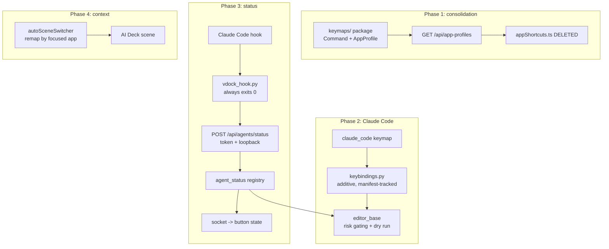

# DL-004 — IDE & AI Agent Control

**Date:** 2026-09-19
**Branch:** `upgrade/upgrade--keypad`
**Spec:** `docs/superpowers/specs/2026-09-19-ide-agent-control-design.md`
**Plans:** four, one per phase:
- `docs/superpowers/plans/2026-09-19-ide-phase1-keymaps.md`
- `docs/superpowers/plans/2026-09-19-ide-phase2-claude-code.md`
- `docs/superpowers/plans/2026-09-19-ide-phase3-hook-status.md`
- `docs/superpowers/plans/2026-09-19-ide-phase4-context-scene.md`

**Status:** Planned — no code written
**Depends on:** DL-002 (every key, path and setup action lives in that settings surface)

## Background

Requested by the user as:

> "I want to have the ability to sync with Claude — meaning in Claude and
> Cursor scenes, I want VDock to actually show actions and interact with
> Cursor, Claude Code. For example a Claude continue button will trigger
> continue in the Claude Code CLI. I want you to add the keyboard shortcuts as
> actions in Claude, Cursor and other IDEs' scene buttons. Look at
> https://code.claude.com/docs/en/keybindings and https://vibekeys.dev/"

Both references were read during design. **VibeKeys is a physical keypad** —
six remappable keys, a rotary knob, and on its Max model a status screen
showing *"Claude Code status, voice feedback and AI responses in real time."*
So the request is, in effect: make VDock a software VibeKeys. The "show
actions" half is as important as the "interact" half.

**Claude Code is a terminal TUI.** Its shortcuts are keystrokes into whatever
terminal hosts it, not application hotkeys — and it reads a user-editable
`~/.claude/keybindings.json` that hot-reloads.

## Problem

More infrastructure existed than expected, and one thing did not work as its
name suggested.

**Already present:** `integrations/keymaps.py` (typed Copilot + Cursor
commands), `integrations/editor_base.py` (a focus guard that refuses to send
keystrokes unless the expected process is foreground),
`integrations/context.py` (resolves the focused editor and its project from the
window title), `services/autoSceneSwitcher.ts`.

**Missing or wrong:**

1. **Two shortcut databases that can drift.** `integrations/keymaps.py`
   (backend, executable) and `frontend/src/data/appShortcuts.ts` (frontend, ~35
   entries) both describe Cursor and VS Code.
2. **`claude_continue` does not continue.** Despite the id, it is labelled
   *"Open Claude Code"* (`claude_pack.py:174-187`) and spawns a **new** terminal
   with `--resume`. Nothing interacts with a session already running — so the
   user's exact example was not covered.
3. **No Claude Code keybindings at all.**
4. **No session state**, so nothing can be shown.

## Questions and Answers

**Q: What should VDock actually know about a running Claude Code session?**
A: **Live status via Claude Code hooks.** `SessionStart`, `Notification`,
`PreToolUse`/`PostToolUse` and `Stop` POST to VDock. Supported, event-driven,
no scraping. Rejected: completion notifications only (buttons stay static);
mirroring the transcript on the deck (duplicates the terminal you are already
looking at); and no status at all (drops half the request).

**Q: How should keystrokes be delivered reliably?**
A: **Guarded keystrokes plus a VDock-managed `keybindings.json`.** VDock binds
its own obscure chords and sends those, so a user who has remapped their
defaults is unaffected. Rejected: sending documented defaults (breaks silently
after any customisation); and CLI one-shots only (safe, but cannot press
Continue or Interrupt on a live session).

**Q: Which apps?**
A: All four groups — Claude Code; Cursor + VS Code/Copilot; other AI CLIs
(Codex, Gemini, OpenCode, Aider); JetBrains + Windsurf + Zed. Roughly ten apps,
which is why this is phased.

**Q: How do buttons reach the deck?**
A: **One auto-switching context scene** whose buttons follow the focused app,
building on `autoSceneSwitcher.ts`. Positions stay fixed across apps so muscle
memory survives an alt-tab. Rejected: one ready-made scene per app; and catalog
actions the user places by hand (~60 buttons).

**Q: Where should app knowledge live?**
A: **Approach C — typed in Python, served to the frontend.** Keymaps stay as
frozen `Command` dataclasses in a `keymaps/` package; `GET /api/app-profiles`
serialises them so `appShortcuts.ts` is deleted.

Rejected (A): extend the pack model as-is — cheapest, but leaves the dual
database and means three places to edit per new app. Rejected (B): fully
data-driven JSON profiles — adding an app becomes a data file, but it discards
the proven `Command` dataclass and `to_macro_steps()` and needs a schema to
replace the type safety given up.

**Q: Three risks were raised. What are the solutions?**
A: Each is answered in the Design below: hook authentication (§Hook status),
`keybindings.json` safety (§Managed keybindings), and mistargeted keystrokes
(§Safety model). The user asked specifically for these to be solved rather than
just flagged.

## Design

### Managed keybindings

Four rules make writing to someone's real `~/.claude/keybindings.json` safe:

1. **Additive only — VDock never writes `null`.** Unbinding is the destructive
   operation in that format; not doing it removes the entire "VDock clobbered
   my bindings" failure class rather than mitigating it.
2. **Ownership lives in VDock's manifest, not the file.** JSON has no comments,
   so a "VDock block" cannot be marked in place. A manifest records every
   `(context, chord)` pair written, and only those are ever removed.
3. **Collision-avoiding allocation.** The file is read first; chords bound by
   Claude Code (`ctrl+x ctrl+k`, `ctrl+x ctrl+e`, `ctrl+x enter`,
   `ctrl+x ctrl+a`, `ctrl+x tab`, `ctrl+x b`, `ctrl+x ctrl+b`) or by the user
   are skipped. VDock allocates from `ctrl+x` + function keys.
4. **Backup, then atomic write.** Claude Code hot-reloads this file, so a
   corrupt write would break the session the user is sitting in front of.

Opt-in, with a dry-run diff shown first and a clean uninstall.

### Hook status

The hook script's single hard requirement: **it cannot disrupt Claude Code.**
It swallows every exception, uses a ~500 ms timeout, and always exits 0. A
VDock that is closed, busy or crashed must be completely invisible to a live
session — a status light is never worth degrading the editor. That is why it is
a script rather than an inline curl.

The endpoint is token-authenticated with `hmac.compare_digest`, **loopback-only
even when `ALLOW_LAN` is true**, payload-capped, and fails closed when no token
is configured. This matters more than it looks: session state is an *interlock*
for sending keystrokes, so forgeable state would defeat the focus guard.

### Safety model

The existing guard checks `foreground_exe() in target_exes`. That is
insufficient here, because the target is *a terminal* — and a terminal might be
running anything. Four layers:

1. **Hook state is the interlock.** A keystroke goes out only when a live
   session is registered. This is where the hook-auth work and the
   wrong-window work solve each other.
2. **Blast-radius classification** on `Command`: `safe` (focus guard only),
   `input` (guard **and** a live session), `destructive` (not one-tap; per-button
   opt-in plus hold-to-confirm).
3. **No approve button ships.** When a permission prompt is waiting the deck's
   job is to *say so* and offer to focus the terminal. Approving a permission
   prompt from a surface that cannot show what is being approved defeats the
   prompt's purpose.
4. **Dry-run mode** logs what would be sent instead of sending it.

### Platform scope

**Windows-first, explicitly.** `target_exes` are `.exe` names,
`context.py:38-44` lists Windows processes, and the focus guard is
Windows-specific — while the README advertises macOS and Linux and Claude Code
runs on all three. `Command` and `AppProfile` carry per-platform fields from the
start, but only the Windows tables are populated. macOS and Linux are a separate
workstream, recorded as a known gap rather than left as a surprise.

## Implementation Plan

- [ ] **Phase 1 — consolidation.** Keymaps package, `AppProfile`,
      `/api/app-profiles`, delete `appShortcuts.ts`. **No behaviour change.**
- [ ] **Phase 2 — Claude Code.** Keymap, managed keybindings, risk gating,
      dry run, relabel `claude_continue`.
- [ ] **Phase 3 — status.** Session registry, hook script, authenticated
      endpoint, session interlock, button rendering.
- [ ] **Phase 4 — context.** Remaining seven apps, context scene,
      destructive-command opt-in UI, AI Deck template.

Each phase is independently shippable. Phase 1 alone is a pure consolidation
worth landing on its own.

## Trade-offs

**Chosen: approach C.** Keeps the proven typed dataclasses and reuses the focus
guard, the plugin manager and the catalog, while still killing the dual
database. Cost: adding an app needs a small Python module rather than a data
file — acceptable, since each new app tends to need process-detection quirks
anyway. A JSON overlay for user-defined apps stays possible later.

**Chosen: VDock binds its own chords.** More moving parts than sending
documented defaults, but it is the difference between working and silently not
working for anyone who has customised their keybindings.

**Chosen: additive-only writes.** Gives up the ability to rebind a key the user
already uses. Worth it: it makes the destructive case structurally impossible.

**Chosen: no approve button.** Deliberately less convenient than VibeKeys'
"accept with a single click". Accepting a code suggestion and approving a
permission prompt are different acts, and only one of them is safe to do
blind. Available as an explicit per-button opt-in.

**Chosen: `claude_continue` keeps its id.** The id is the misleading part, but
user buttons reference it and renaming it would break them. Only the label and
description change; the new `cc_continue` does the real thing.

**Chosen: Windows-first.** Stated rather than hidden. Half-populating the mac
tables would be worse than leaving them empty.

**Rejected: transcript mirroring, voice input, any non-keystroke control
channel** — no public interface exists for a running Claude Code session.

## Verification Criteria

**Phase 1** — every existing Cursor/Copilot command keeps its id, keys and
macro steps; a pre-existing user button still works; `grep appShortcuts` comes
back clean.

**Phase 2** — the keybindings writer never emits `null`; user bindings survive;
Claude Code's reserved chords are never allocated over; a failure mid-write
leaves the original intact; uninstall removes exactly the manifest pairs; no
`Confirmation`-context command ships.

**Phase 3** — the hook script exits 0 when the backend is unreachable, errors,
or returns 500, verified end-to-end in a subprocess; a wrong or missing token
is rejected; non-loopback is rejected with `ALLOW_LAN=True`; an unconfigured
token fails closed; an `input` command refuses with no live session.
**Manual:** Claude Code runs completely normally with the VDock backend
stopped, and **no button can approve a permission prompt.**

**Phase 4** — every profile's layout references only real commands and is 4
wide; no destructive command ships by default; a terminal agent's `input`
commands all require a session; context scenes fall back rather than blanking;
existing scenes are unchanged. **Manual:** dry-run sweep of every new app's
buttons against that app's real shortcuts before any live use.

## Implementation Results

### Phase 2 — Claude Code control (shipped, with deviations)

**Keystroke delivery.** `backend/integrations/keymaps/claude_code.py` defines
nine `cc_*` commands — `cc_interrupt` (Esc), `cc_mode` (Shift+Tab),
`cc_clear`, `cc_resume`, `cc_compact`, `cc_model`, `cc_add_file`, `cc_help`,
and `cc_exit` (Ctrl+C ×2) — all targeting `TERMINAL_EXES` with
`window_title_hint='claude'`. `claude_code_pack.py` exposes them through
`KeystrokeEditorPlugin`. The `claude-code` scene template in
`appTemplates.ts` now offers live-session buttons.

**Focus-first delivery (the touch-deck fix).** Tapping a VDock button steals
focus to the browser, so keystrokes never reached the app — this is the
actual reason the Claude scene appeared dead. `editor_base.send()` now
raises the target window first via `utils/window_focus.py`
(EnumWindows + force-foreground on Windows, `prefer_title` picks the tab
whose title hints at the session), waits `FOCUS_SETTLE_SECONDS`, then runs
the original foreground-process guard before `MacroAction` types anything.
`app_monitor` records window handles to support this. Per-button
`focus_first` and `enforce_focus` config fields ship on every keystroke
action.

**Gating.** `keymaps/base.py` `Command` gained `risk`, `requires_session`,
`session_marker`, `window_title_hint`, `repeat`, `types_text`/`submit`,
`category`, `priority`. Destructive commands refuse unless the button opts
in (`allow_destructive`, default off); only `cc_exit` is destructive and no
Confirmation-context command ships. `requires_session` commands are gated by
`integrations/sessions.py` — a **process scan**, not the Phase-3 hook
registry, which is the main deviation: hooks and live status remain
unimplemented. A second deviation: no managed `keybindings.json` writer —
commands send keystrokes directly rather than remapping Claude Code's own
bindings.

**Compatibility.** `claude_continue` keeps its id and still spawns
`claude --resume` in a new terminal; only its label/description were
corrected. Existing Cursor/Copilot commands are unchanged (Phase-1
verification holds).

**Tests.** `test_integrations.py` mocks the new focus step; new cases cover
the session gate, destructive opt-in, and focus-first macro steps.
`test_keymaps_package.py` union/default assertions updated for the third
pack. Result: **717 backend tests pass**; `vue-tsc` clean; **115 frontend
tests pass**.

**Not started:** Phase 3 (hooks, live session status, session-aware
interlock beyond process scan), Phase 4 (remaining ~8 apps, context scene).

### Porting note — merge into `feat/unified-background`

The running app served `.worktrees/unified-background`, which had branched
before Phase 1; the work above was developed on `upgrade/upgrade--keypad`
(commits `2729768`, `e6bc18e`) and merged here in `79eedbf`. One conflict:
`SettingsView.vue`'s search index — resolved by keeping this branch's
unified `Background` entry (its two background pickers were merged into
one) plus the new `Weather Widget Size` entry. Post-merge: **719 backend
tests pass** (717 + 2 unified-background persistence tests), `vue-tsc`
clean. The live `Claude` scene (`scene-1789846753894`) was rewired via the
profiles API: `New Session`→`cc_clear`, `Open Claude Code`→`claude_continue`,
`Resume`→`cc_resume`, `Add File`→`cc_add_file`, `Interrupt`→`cc_interrupt` —
button ids, positions and styles preserved.
